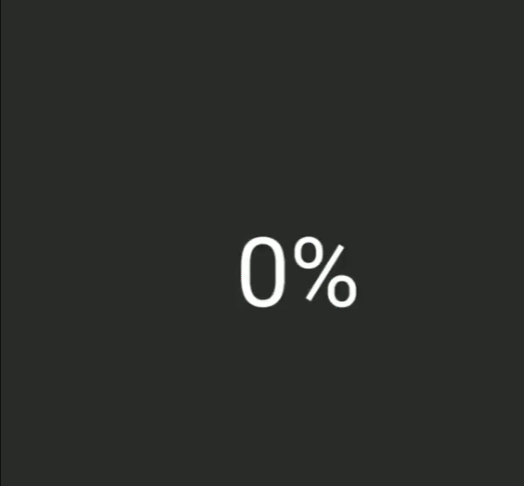

# 属性动画

## ViewPropertyAnimator

使用方式：`View.animate()` 后跟 `translationX()` 等方法，动画会自动执行。

```java
view.animate().translationX(500);
```


具体可以跟的方法以及方法所对应的 `View` 中的实际操作的方法如下表所示：

| View 中的方法  | 功能              | 对应的 ViewPropertyAnimator 中的方法 |
| -------------- | ----------------- | ------------------------------------ |
| setTransitionX | 设置 x 轴偏移     | transitionX, transitionXBy           |
| setTransitionY | 设置 y 轴偏移     | transitionY, transitionYBy           |
| setTransitionZ | 设置 z 轴偏移     | transitionZ, transitionZBy           |
| setX           | 设置 x 轴绝对位置 | x, xBy                               |
| setY           | 设置 y 轴绝对位置 | y, yBy                               |
| setZ           | 设置 z 轴绝对位置 | z, zBy                               |
| setRotation    | 设置平面旋转      | rotation, rotationBy                 |
| setRotationX   | 设置沿 x 轴旋转   | rotationX, rotationXBy               |
| setRotationY   | 设置沿 y 轴旋转   | rotationY, rotationYBy               |
| setScaleX      | 设置横向缩放      | scaleX, scaleXBy                     |
| setScaleY      | 设置纵向缩放      | scaleY, scaleYBy                     |
| setAlpha       | 设置透明度        | alpha, alphaBy                       |

表中不带 by 的方法是设置绝对值的方法，带 by 是增量方法。

## ValueAnimator

ValueAnimator 只是一个值变化的动画，不会改变其它东西，需要结合监听器使用。

```java
ValueAnimator valueAnimator = ValueAnimator.ofFloat(0, 100);
valueAnimator.setDuration(3000);
 
valueAnimator.addUpdateListener(new AnimatorUpdateListener() {
 
    @Override
    public void onAnimationUpdate(ValueAnimator animation) {
        float value = (Float) animation.getAnimatedValue();
        ivImage.setTranslationX(value);
    }
});
valueAnimator.start();
```

## ObjectAnimator

使用方式：

1. 如果是自定义控件，需要添加 `setter` / `getter` 方法；
2. 用 `ObjectAnimator.ofXXX()` 创建 `ObjectAnimator` 对象；
3. 用 `start()` 方法执行动画。

```java
public class SportsView extends View {
		float progress = 0;
    
    ......
    
    // 创建 getter 方法
    public float getProgress() {
        return progress;
    }

    // 创建 setter 方法
    public void setProgress(float progress) {
        this.progress = progress;
        invalidate();
    }
    
    @Override
    public void onDraw(Canvas canvas) {
        super.onDraw(canvas);
        
        ......
        
        canvas.drawArc(arcRectF, 135, progress * 2.7f, false, paint);
        
        ......
    }
}

......

// 创建 ObjectAnimator 对象
ObjectAnimator animator = ObjectAnimator.ofFloat(view, "progress", 0, 65);
// 执行动画
animator.start();
```



### PropertyValuesHolder 同一个动画中改变多个属性

很多时候，你在同一个动画中会需要改变多个属性，例如在改变透明度的同时改变尺寸。如果使用 `ViewPropertyAnimator`，可以直接用连写的方式来在一个动画中同时改变多个属性：

```java
view.animate()
        .scaleX(1)
        .scaleY(1)
        .alpha(1);
```


而对于 `ObjectAnimator`，是不能这么用的。不过你可以使用 `PropertyValuesHolder` 来同时在一个动画中改变多个属性。

```java
PropertyValuesHolder holder1 = PropertyValuesHolder.ofFloat("scaleX", 1);
PropertyValuesHolder holder2 = PropertyValuesHolder.ofFloat("scaleY", 1);
PropertyValuesHolder holder3 = PropertyValuesHolder.ofFloat("alpha", 1);
 
ObjectAnimator animator = ObjectAnimator.ofPropertyValuesHolder(view, holder1, holder2, holder3)
animator.start();
```

`PropertyValuesHolder` 的意思从名字可以看出来，它是一个属性值的批量存放地。所以你如果有多个属性需要修改，可以把它们放在不同的 `PropertyValuesHolder` 中，然后使用 `ofPropertyValuesHolder()` 统一放进 `Animator`。这样你就不用为每个属性单独创建一个 `Animator` 分别执行了。

## 关键帧拆分

除了合并多个属性和调配多个动画，你还可以在 `PropertyValuesHolder` 的基础上更进一步，通过设置 `Keyframe` （关键帧），把同一个动画属性拆分成多个阶段。例如，你可以让一个进度增加到 100% 后再「反弹」回来。

```java
// 在 0% 处开始
Keyframe keyframe1 = Keyframe.ofFloat(0, 0);
// 时间经过 50% 的时候，动画完成度 100%
Keyframe keyframe2 = Keyframe.ofFloat(0.5f, 100);
// 时间见过 100% 的时候，动画完成度倒退到 80%，即反弹 20%
Keyframe keyframe3 = Keyframe.ofFloat(1, 80);
PropertyValuesHolder holder = PropertyValuesHolder.ofKeyframe("progress", keyframe1, keyframe2, keyframe3);

ObjectAnimator animator = ObjectAnimator.ofPropertyValuesHolder(view, holder);
animator.start();
```


## AnimatorSet 组合动画

有的时候，你不止需要在一个动画中改变多个属性，还会需要多个动画配合工作，比如，在内容的大小从 0 放大到 100% 大小后开始移动。这种情况使用 `PropertyValuesHolder` 是不行的，因为这些属性如果放在同一个动画中，需要共享动画的开始时间、结束时间、Interpolator 等等一系列的设定，这样就不能有先后次序地执行动画了。

这就需要用到 `AnimatorSet` 了。

```java
ObjectAnimator animator1 = ObjectAnimator.ofFloat(...);
animator1.setInterpolator(new LinearInterpolator());
ObjectAnimator animator2 = ObjectAnimator.ofInt(...);
animator2.setInterpolator(new DecelerateInterpolator());
 
AnimatorSet animatorSet = new AnimatorSet();
// 两个动画依次执行
animatorSet.playSequentially(animator1, animator2);
animatorSet.start();
```


使用 `playSequentially()`，就可以让两个动画依次播放，而不用为它们设置监听器来手动为他们监管协作。

`AnimatorSet` 还可以这么用：

```java
// 两个动画同时执行
animatorSet.playTogether(animator1, animator2);
animatorSet.start();
```

以及这么用：

```java
// 使用 AnimatorSet.play(animatorA).with/before/after(animatorB)
// 的方式来精确配置各个 Animator 之间的关系
animatorSet.play(animator1).with(animator2);
animatorSet.play(animator1).before(animator2);
animatorSet.play(animator1).after(animator2);
animatorSet.start();
```

有了 `AnimatorSet` ，你就可以对多个 `Animator` 进行统一规划和管理，让它们按照要求的顺序来工作。

