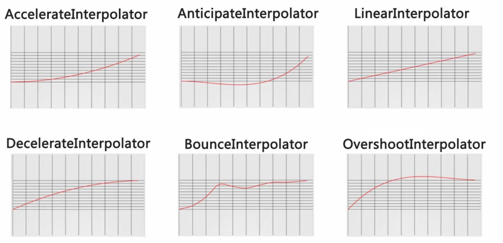

# 插值器

## 简介

插值器用于修改一个动画过程中的速率，可以定义各种各样的非线性变化函数，比如加速、减速等。

在 Android 中所有的插值器都是 **Interpolator的子类**，通过`android:interpolator`属性你可以引用不同的插值器。

## 常用插值器

Android 已经定义好了一些插值器，我们可以直接使用它们。

| Interpolator class               | Resource Id                                      | 效果                                                         |
| -------------------------------- | ------------------------------------------------ | ------------------------------------------------------------ |
| AccelerateDecelerateInterpolator | @android:anim/accelerate_decelerate_interpolator | 在动画开始与介绍的地方速率改变比较慢，在中间的时候加速       |
| AccelerateInterpolator           | @android:anim/accelerate_interpolator            | 在动画开始的地方速率改变比较慢，然后开始加速                 |
| AnticipateInterpolator           | @android:anim/anticipate_interpolator            | 开始的时候向后然后向前甩                                     |
| AnticipateOvershootInterpolator  | @android:anim/anticipate_overshoot_interpolator  | 开始的时候向后然后向前甩一定值后返回最后的值                 |
| BounceInterpolator               | @android:anim/bounce_interpolator                | 动画结束的时候弹起                                           |
| CycleInterpolator                | @android:anim/cycle_interpolator                 | 动画循环播放特定的次数，速率改变沿着正弦曲线                 |
| DecelerateInterpolator           | @android:anim/decelerate_interpolator            | 在动画开始的地方快然后慢                                     |
| FastOutLinearInInterpolator      | ---                                              | 加速运动，但加速曲线和 AccelerateInterpolator 不同           |
| FastOutSlowInInterpolator        | ---                                              | 先加速后减速，但前期加速度较 AccelerateDecelerateInterpolator 更大 |
| LinearInterpolator               | @android:anim/linear_interpolator                | 以常量速率改变                                               |
| LinearOutSlowInInterpolator      | ---                                              | 减速，相比 DecelerateInterpolator 前期速度更快               |
| OvershootInterpolator            | @android:anim/overshoot_interpolator             | 向前甩一定值后再回到原来位置                                 |

### 图像



## 使用

可以通过下面的方式使用它们

```xml
<set android:interpolator="@android:anim/accelerate_interpolator">
        ...
</set>
```

## 自定义插值器

### 调整插值器属性

如果你对系统提供的插值器不满意，我们可以创建一个插值器资源修改插值器的属性，比如修改 **AnticipateInterpolator** 的加速速率，调整 **CycleInterpolator** 的循环次数等。为了完成这种需求，我们需要创建 XML 资源文件，然后将其放于`/res/anim`下，然后再动画元素中引用即可。

```xml
<?xml version="1.0" encoding="utf-8"?>
<InterpolatorName xmlns:android="http://schemas.android.com/apk/res/android"
        android:attribute_name="value"/>
```

### 可调整属性

以下属性可以用在特定的插值器上

* `factor`: 浮点值，加速速率，默认为1
* `factor` 浮点值，减速的速率，默认为1
* `tension`: 浮点值，起始点后退的张力、拉力数，默认为2
* `tension`: 同上
* `extraTension`: 浮点值，拉力的倍数，默认为1.5（2 * 1.5）
* `cycles`: int，循环次数，默认为1

### 自定义插值器

我们也可以通过实现 **Interpolator** 接口来自行构造一个插值器：

线性（匀速）插值器定义如下：

```java
public float getInterpolation(float input) {
    return input;  
}
```

加速减速插值器定义如下：

```java
public float getInterpolation(float input) {
    return (float)(Math.cos((input + 1) * Math.PI) / 2.0f) + 0.5f;  
}
```