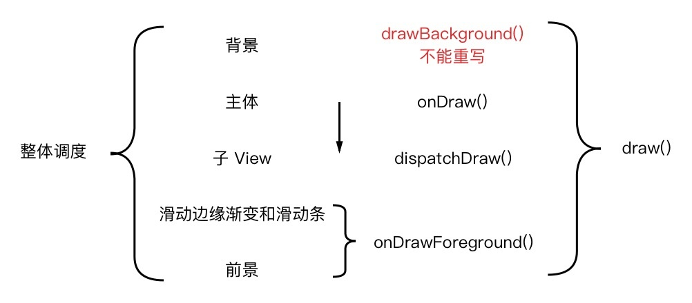

# Android View 绘制顺序

## 绘制顺序

### 整体调度

> 1. 在 ViewGroup 的子类中重写除`dispatchDraw()`以外的绘制方法时，可能需要调用`setWillNotDraw(false)`；
> 2. 在重写的方法有多个选择时，优先选择`onDraw()`。

### 表格

| 重写的方法           | 绘制代码的位置                 | 绘制内容出现的位置       |
| -------------------- | ------------------------------ | ------------------------ |
| `onDraw()`           | `super.onDraw()`之前           | 背景和原主体内容之间     |
| `onDraw()`           | `super.onDraw()`之后           | 原主体内容和子 View 之间 |
| `dispatchDraw()`     | `super.dispatchDraw()`之前     | 原主体内容和子 View 之间 |
| `dispatchDraw()`     | `super.dispatchDraw()`之后     | 子 View 和前景之间       |
| `onDrawForeground()` | `super.onDrawForeground()`之前 | 子 View 和前景之间       |
| `onDrawForeground()` | `super.onDrawForeground()`之后 | 盖住前景                 |
| `draw()`             | `super.draw()`之前             | 被背景盖住               |
| `draw()`             | `super.draw()`之前             | 盖住前景                 |