# Android Paint 绘制效果

效果类的 API ，指的就是抗锯齿、填充/轮廓、线条宽度等等这些。

## 1 抗锯齿

`setAntiAlias(boolean aa) `

## 2 图形线条风格

`setStyle(Paint.Style style)`

线条风格有三种：`FILL`填充、`STROKE`边框、`FILL_AND_STROKE`同时填充并画边框。

## 3 线条形状

### 3.1 线条宽度

`setStrokeWidth(float width)`

### 3.2 笔头形状

`setStrokeCap(Paint.Cap cap)`

线头形状有三种：`BUTT`平头、`ROUND`圆头、`SQUARE`方头。默认为`BUTT`。

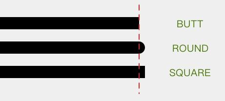

### 3.3 拐角形状

`setStrokeJoin(Paint.Join join)`

有三个值可以选择：`MITER`尖角、`BEVEL`平角和`ROUND`圆角。默认为`MITER`。

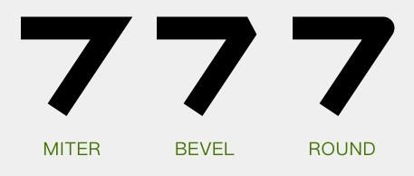

### 3.4 拐角限制

`setStrokeMiter(float miter)`

当线条拐角为`MITER`时，拐角处的外缘需要使用延长线来补偿：

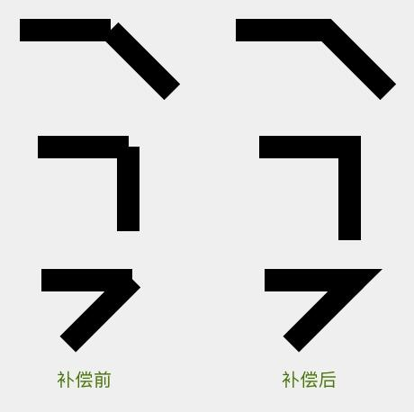

定义此值为`miter`

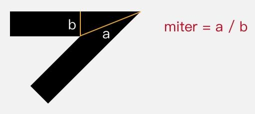

当补偿值大于`miter`时候，将会自动切换到`BEVEL`

# 4 色彩优化

## 4.1 抖动

`setDither(boolean dither)`

加入抖动就是把图像从较高色彩深度（即可用的颜色数）向较低色彩深度的区域绘制时，在图像中有意地插入噪点，通过有规律地扰乱图像来让图像对于肉眼更加真实的做法。

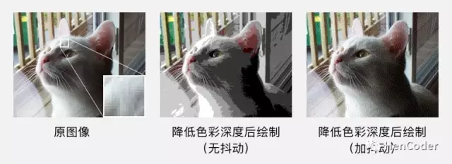

## 4.2 双线性过滤

`setFilterBitmap(boolean filter)`

图像在放大绘制的时候，默认使用的是最近邻插值过滤，这种算法简单，但会出现马赛克现象；而如果开启了双线性过滤，就可以让结果图像显得更加平滑。

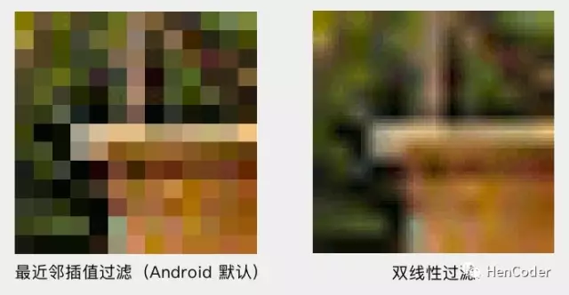

# 5 PathEffect

PathEffect 是用来给图形的轮廓设置效果的。

## 5.1 CornerPathEffect

把所有拐角变成圆角。

```java
PathEffect pathEffect = new CornerPathEffect(20);
paint.setPathEffect(pathEffect);

...

canvas.drawPath(path, paint);
```

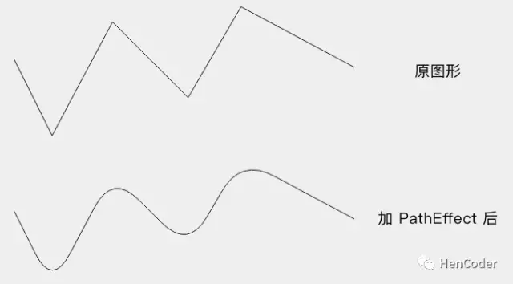

## 5.2 DiscretePathEffect

把线条进行随机的偏离，让轮廓变得乱七八糟。乱七八糟的方式和程度由参数决定。

```java
PathEffect pathEffect = new DiscretePathEffect(20, 5);
paint.setPathEffect(pathEffect);

...

canvas.drawPath(path, paint);
```

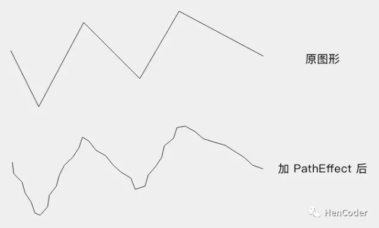

**DiscretePathEffect** 具体的做法是，把绘制改为使用定长的线段来拼接，并且在拼接的时候对路径进行随机偏离。它的构造方法`DiscretePathEffect(float segmentLength, float deviation)`的两个参数中，`segmentLength`是用来拼接的每个线段的长度，`deviation`是偏离量。

## 5.3 DashPathEffect

使用虚线来绘制线条。

```java
PathEffect pathEffect = new DashPathEffect(new float[]{20, 10, 5, 10}, 0);
paint.setPathEffect(pathEffect);

...

canvas.drawPath(path, paint);
```

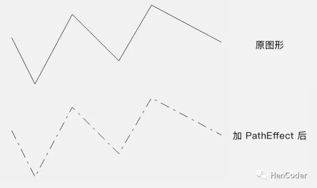

它的构造方法`DashPathEffect(float[] intervals, float phase)`中，第一个参数`intervals`是一个数组，它指定了虚线的格式：数组中元素必须为偶数（最少是 2 个），按照「画线长度、空白长度、画线长度、空白长度」……的顺序排列，例如上面代码中的 20, 5, 10, 5 就表示虚线是按照「画 20 像素、空 5 像素、画 10 像素、空 5 像素」的模式来绘制；第二个参数`phase`是虚线的偏移量。

## 5.4 PathDashPathEffect

使用一个 Path 来绘制「虚线」。

```java
Path dashPath = ...; // 使用一个三角形来做 dash
PathEffect pathEffect = new PathDashPathEffect(dashPath, 40, 0,
        PathDashPathEffectStyle.TRANSLATE);
paint.setPathEffect(pathEffect);

...

canvas.drawPath(path, paint);
```

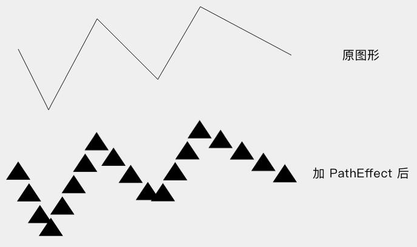

其构造方法中`PathDashPathEffect(Path shape, float advance, float phase, PathDashPathEffect.Style style)`，`shape`是用于绘制的`Path`，`advance`是相邻两个`Path`起点的距离，`style`是拐角时的处理方式，如下所示：

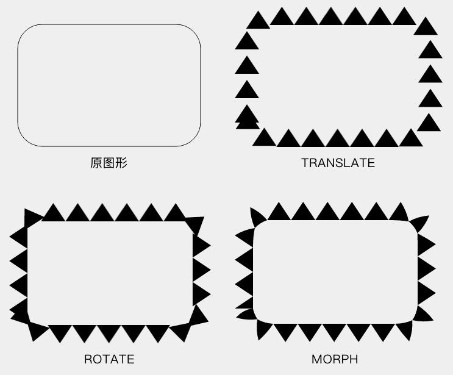

## 5.5 SumPathEffect

这是一个组合效果类的 PathEffect 。它的行为特别简单，就是分别按照两种 PathEffect 分别对目标进行绘制。

```java
PathEffect dashEffect = new DashPathEffect(new float[]{20, 10}, 0);
PathEffect discreteEffect = new DiscretePathEffect(20, 5); 
pathEffect = new SumPathEffect(dashEffect, discreteEffect);

...

canvas.drawPath(path, paint);
```

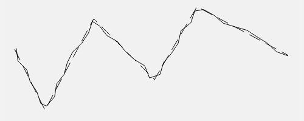

## 5.6 ComposePathEffect

这也是一个组合效果类的 PathEffect 。不过它是先对目标 Path 使用一个 PathEffect，然后再对这个改变后的 Path 使用另一个 PathEffect。

```java
PathEffect dashEffect = new DashPathEffect(new float[]{20, 10}, 0);
PathEffect discreteEffect = new DiscretePathEffect(20, 5); 
pathEffect = new ComposePathEffect(dashEffect, discreteEffect);

...

canvas.drawPath(path, paint);
```

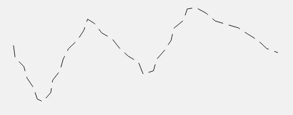

它的构造方法`ComposePathEffect(PathEffect outerpe, PathEffect innerpe)`中的两个 PathEffect 参数，`innerpe`是先应用的，`outerpe`是后应用的。

> PathEffect 在有些情况下不支持硬件加速，需要关闭硬件加速才能正常使用：
>
> 1. `Canvas.drawLine()`和`Canvas.drawLines()`方法画直线时，`setPathEffect()`是不支持硬件加速的；
> 2. **PathDashPathEffect** 对硬件加速的支持也有问题，所以当使用 **PathDashPathEffect** 的时候，最好也把硬件加速关了。

# 6 阴影

在之后的绘制内容下面加一层阴影。

`setShadowLayer(float radius, float dx, float dy, int shadowColor)`

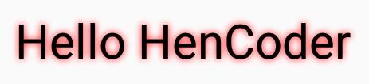

方法的参数里，`radius`是阴影的模糊范围；`dx`,`dy`是阴影的偏移量；`shadowColor`是阴影的颜色。

如果要清除阴影层，使用`clearShadowLayer()`。

> * 在硬件加速开启的情况下，`setShadowLayer()`只支持文字的绘制，文字之外的绘制必须关闭硬件加速才能正常绘制阴影。
> * 如果`shadowColor`是半透明的，阴影的透明度就使用`shadowColor`自己的透明度；而如果`shadowColor`是不透明的，阴影的透明度就使用`paint`的透明度。

# 7 MaskFilter

设置在绘制层上方的附加效果。

> **ColorFilter** 是对每个像素的颜色进行过滤；而 **MaskFilter** 则是基于整个画面来进行过滤。

## 7.1 BlurMaskFilter

模糊效果。

```java
paint.setMaskFilter(new BlurMaskFilter(50, BlurMaskFilter.Blur.NORMAL));

...

canvas.drawBitmap(bitmap, 100, 100, paint);
```

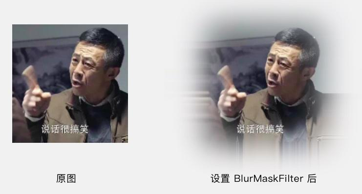

它的构造方法`BlurMaskFilter(float radius, BlurMaskFilter.Blur style)`中，`radius`参数是模糊的范围，`style`是模糊的类型。

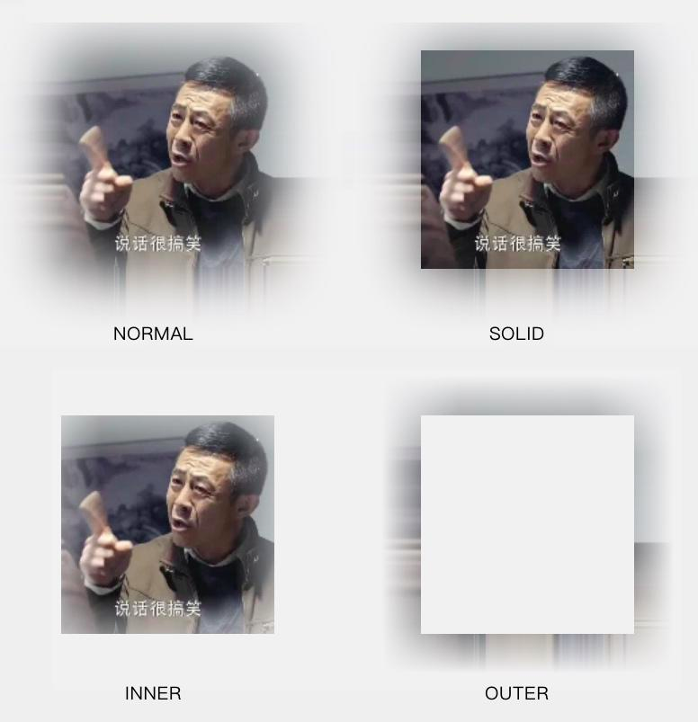

## 7.2 EmbossMaskFilter

浮雕效果

```java
paint.setMaskFilter(new EmbossMaskFilter(new float[]{0, 1, 1}, 0.2f, 8, 10));

...

canvas.drawBitmap(bitmap, 100, 100, paint);
```

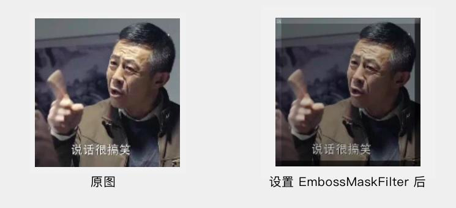

它的构造方法`EmbossMaskFilter(float[] direction, float ambient, float specular, float blurRadius)`的参数里，`direction`是一个 3 个元素的数组，指定了光源的方向；`ambient`是环境光的强度，数值范围是`0~1`；`specular`是炫光的系数；`blurRadius`是应用光线的范围。

# 8 获取绘制的 Path

## 8.1 绘制图形 Path

getFillPath(Path src, Path dst)

所谓实际 **Path** ，指的就是`drawPath()`的绘制内容的轮廓，要算上线条宽度和设置的 **PathEffect**。

方法的参数里，`src`是原 **Path** ，而`dst`就是实际 **Path** 的保存位置。`getFillPath(src, dst)`会计算出实际 **Path**，然后把结果保存在`dst`里。

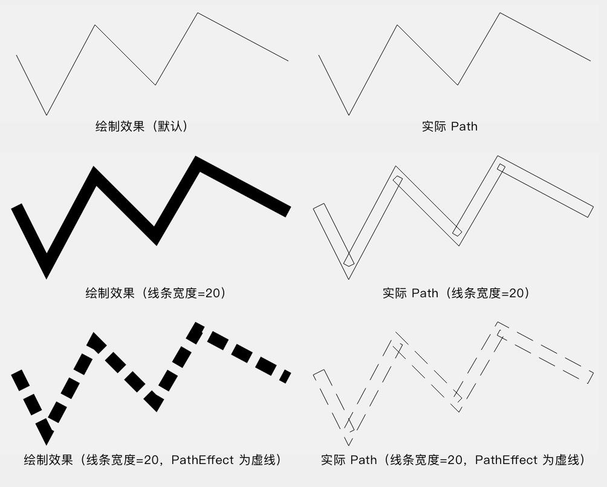

## 绘制文字 Path

* `getTextPath(String text, int start, int end, float x, float y, Path path)`
* `getTextPath(char[] text, int index, int count, float x, float y, Path path)`

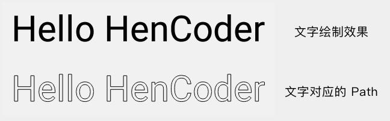

它们主要是用于图形和文字的装饰效果的位置计算，比如自定义的下划线效果。

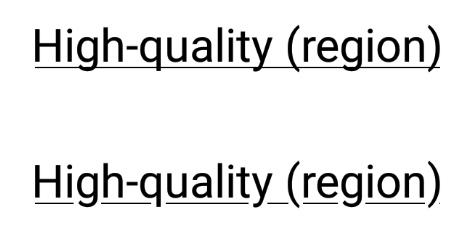