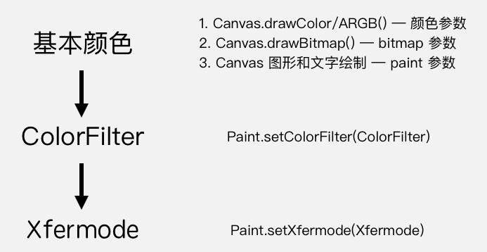

# Android 绘制颜色

**Canvas** 绘制的内容，有三层对颜色的处理：



## 1 基本颜色

| Canvas 的方法                                           | 像素颜色的设置方式           |
| ------------------------------------------------------- | ---------------------------- |
| drawColor/RGB/ARGB()                                    | 直接作为参数传入             |
| drawBitmap()                                            | 与 bitmap 参数的像素颜色相同 |
| 图形和文字 (drawCircle() / drawPath() / drawText() ...) | 在 paint 参数中设置          |

### 1.1 直接设置颜色

* `setColor(int color)`
* `setARGB(int a, int r, int g, int b)`

#### 1.2 Shader 设置颜色

##### 1.2.1 LinearGradient

设置两个点和两种颜色，以这两个点作为端点，使用两种颜色的渐变来绘制颜色。就像这样：

```java
Shader shader = new LinearGradient(100, 100, 500, 500, Color.parseColor("#E91E63"),
        Color.parseColor("#2196F3"), Shader.TileMode.CLAMP);
paint.setShader(shader);
...
canvas.drawCircle(300, 300, 200, paint);
```


构造方法：

```java
LinearGradient(float x0, float y0, float x1, float y1, int color0, int color1, Shader.TileMode tile)
```

> `tile`：端点范围之外的着色规则，类型是 **TileMode**。**TileMode** 一共有 3 个值可选：`CLAMP`, `MIRROR`和`REPEAT`。

CLAMP：


MIRROR：


REPEAT：


##### 1.2.2 RadialGradient

辐射渐变很好理解，就是从中心向周围辐射状的渐变。大概像这样：

```java
Shader shader = new RadialGradient(300, 300, 200, Color.parseColor("#E91E63"),
        Color.parseColor("#2196F3"), Shader.TileMode.CLAMP);
paint.setShader(shader);

...

canvas.drawCircle(300, 300, 200, paint);
```


构造方法：

```java
RadialGradient(float centerX, float centerY, float radius, int centerColor, int edgeColor, TileMode tileMode)
```

CLAMP：


MIRROR:


REPEAT:


##### 1.2.3 SweepGradient

扫描渐变，类似雷达。

```java
Shader shader = new SweepGradient(300, 300, Color.parseColor("#E91E63"),
        Color.parseColor("#2196F3"));
paint.setShader(shader);

...

canvas.drawCircle(300, 300, 200, paint);
```


构造方法：

```java
SweepGradient(float cx, float cy, int startColor, int endColor)
```

##### 1.2.4 BitmapShader

Bitmap 着色

```java
Bitmap bitmap = BitmapFactory.decodeResource(getResources(), R.drawable.batman);
Shader shader = new BitmapShader(bitmap, Shader.TileMode.CLAMP, Shader.TileMode.CLAMP);
paint.setShader(shader);

...

canvas.drawCircle(300, 300, 200, paint);
```


> 看着跟`Canvas.drawBitmap()`好像啊？事实上也是一样的效果。
>
> 如果你想绘制圆形的`Bitmap`，就别用`drawBitmap()`了，改用`drawCircle()` + `BitmapShader`就可以了（其他形状同理）。

构造方法：

```java
BitmapShader(Bitmap bitmap, Shader.TileMode tileX, Shader.TileMode tileY)
```

CLAMP:


MIRROR:


REPEAT:


##### 1.2.5 ComposeShader

混合着色器，把两个 **Shader** 一起使用。

```java
// 第一个 Shader：头像的 Bitmap
Bitmap bitmap1 = BitmapFactory.decodeResource(getResources(), R.drawable.batman);
Shader shader1 = new BitmapShader(bitmap1, Shader.TileMode.CLAMP, Shader.TileMode.CLAMP);

// 第二个 Shader：从上到下的线性渐变（由透明到黑色）
Bitmap bitmap2 = BitmapFactory.decodeResource(getResources(), R.drawable.batman_logo);
Shader shader2 = new BitmapShader(bitmap2, Shader.TileMode.CLAMP, Shader.TileMode.CLAMP);

// ComposeShader：结合两个 Shader
Shader shader = new ComposeShader(shader1, shader2, PorterDuff.Mode.SRC_OVER);
paint.setShader(shader);

...

canvas.drawCircle(300, 300, 300, paint);
```

> 注意：上面这段代码中我使用了两个 **BitmapShader** 来作为`ComposeShader()`的参数，而`ComposeShader()`在硬件加速下是不支持两个相同类型的 **Shader** 的，所以这里也需要关闭硬件加速才能看到效果。

构造方法：

```java
ComposeShader(Shader shaderA, Shader shaderB, PorterDuff.Mode mode)
```

PorterDuff.Mode：

用来描述 shaderB 与 shaderA 如何结合的类。


* Alpha 合成
    
* 混合合成
    

## 2 ColorFilter

为绘制的内容设置一个统一的过滤策略，然后`Canvas.drawXXX()`方法会对每个像素都进行过滤后再绘制出来。

> 与戴墨镜的效果类似。

在 **Paint** 里设置 **ColorFilter** ，使用的是`Paint.setColorFilter(ColorFilter filter)`方法。**ColorFilter** 并不直接使用，而是使用它的子类。

它共有三个子类：`LightingColorFilter`,`PorterDuffColorFilter`和`ColorMatrixColorFilter`。

### 2.1 LightingColorFilter

模拟简单的光照效果的颜色滤镜。

构造方法：

```java
// 参数都是和颜色相同的 int 值，mul 为乘系数，add 为加系数
LightingColorFilter(int mul, int add) 
```

计算过程：

```
R' = R * mul.R / 0xff + add.R
G' = G * mul.G / 0xff + add.G
B' = B * mul.B / 0xff + add.B
```

一个「保持原样」的「基本 **LightingColorFilter** 」，`mul`为`0xffffff`，`add`为`0x000000`（也就是0），那么对于一个像素，它的计算过程就是：

```
R' = R * 0xff / 0xff + 0x0 = R
G' = G * 0xff / 0xff + 0x0 = G
B' = B * 0xff / 0xff + 0x0 = B
```

基于这个「基本 **LightingColorFilter** 」，你就可以修改一下做出其他的 **filter**。比如，如果你想去掉原像素中的红色，可以把它的`mul`改为`0x00ffff`（红色部分为 0 ） ，那么它的计算过程就是：

```
R' = R * 0x0 / 0xff + 0x0 = 0 // 红色被移除
G' = G * 0xff / 0xff + 0x0 = G
B' = B * 0xff / 0xff + 0x0 = B
```

实现代码：

```java
ColorFilter lightingColorFilter = new LightingColorFilter(0x00ffff, 0x000000);
paint.setColorFilter(lightingColorFilter);
```

效果图：


### 2.2 PorterDuffColorFilter

使用一个指定的颜色和一种指定的 **PorterDuff.Mode** 来与绘制对象进行合成。

> 效果与混合着色基本相同。

构造方法：

```java
PorterDuffColorFilter(int color, PorterDuff.Mode mode)
```

### 2.3 ColorMatrixColorFilter

颜色矩阵变换滤镜，使用一个 **ColorMatrix** 来对颜色进行处理。 

**ColorMatrix** 这个类，内部是一个 4x5 的矩阵：

```
[ a, b, c, d, e,
  f, g, h, i, j,
  k, l, m, n, o,
  p, q, r, s, t ]
```

通过计算， **ColorMatrix** 可以把要绘制的像素进行转换。对于颜色`[R, G, B, A]`，转换算法是这样的：

```
R’ = a*R + b*G + c*B + d*A + e;
G’ = f*R + g*G + h*B + i*A + j;
B’ = k*R + l*G + m*B + n*A + o;
A’ = p*R + q*G + r*B + s*A + t;
```

## 3 Xfermode

> Transfer mode，用`X`来代替`Trans`是一些美国人喜欢用的简写方式。

**Xfermode** 指的是你要绘制的内容和 **Canvas** 的目标位置的内容应该怎样结合计算出最终的颜色。

以绘制的内容作为源图像，以 View 中已有的内容作为目标图像，选取一个 **PorterDuff.Mode** 作为绘制内容的颜色处理方案。就像这样：

```java
Xfermode xfermode = new PorterDuffXfermode(PorterDuff.Mode.DST_IN);

...

canvas.drawBitmap(rectBitmap, 0, 0, paint); // 画方
paint.setXfermode(xfermode); // 设置 Xfermode
canvas.drawBitmap(circleBitmap, 0, 0, paint); // 画圆
paint.setXfermode(null); // 用完及时清除 Xfermode
```


**PorterDuff.Mode** 在 **Paint** 一共有三处 API ，它们的工作原理都一样，只是用途不同：

| API                   | 用途                                         |
| --------------------- | -------------------------------------------- |
| ComposeShader         | 混合两个 Shader                              |
| PorterDuffColorFilter | 增加一个单色的 ColorFilter                   |
| Xfermode              | 设置绘制内容和 View 中已有内容的混合计算方式 |

> 创建 **Xfermode** 的时候其实是创建的它的唯一子类 **PorterDuffXfermode**。

### 3.1 Xfermode 注意事项

**Xfermode** 使用很简单，不过有两点需要注意：

#### 使用离屏缓冲（Off-screen Buffer）

实质上，上面这段例子代码，如果直接执行的话是不会绘制出图中效果的，程序的绘制也不会像上面的动画那样执行，而是会像这样：


按照逻辑我们会认为，在第二步画圆的时候，跟它共同计算的是第一步绘制的方形。但实际上，却是整个 **View** 的显示区域都在画圆的时候参与计算，并且 **View** 自身的底色并不是默认的透明色，而且是遵循一种迷之逻辑，导致不仅绘制的是整个圆的范围，而且在范围之外都变成了黑色。就像这样：


要想使用`setXfermode()`正常绘制，必须使用离屏缓存 (Off-screen Buffer) 把内容绘制在额外的层上，再把绘制好的内容贴回 View 中。也就是这样：


#### 使用离屏缓冲的方式：

* `Canvas.saveLayer()`

该方法可以做短时的离屏缓冲。在绘制代码的前后各加一行代码，在绘制之前保存，绘制之后恢复：

```java
int saved = canvas.saveLayer(null, null, Canvas.ALL_SAVE_FLAG);

canvas.drawBitmap(rectBitmap, 0, 0, paint); // 画方
paint.setXfermode(xfermode); // 设置 Xfermode
canvas.drawBitmap(circleBitmap, 0, 0, paint); // 画圆
paint.setXfermode(null); // 用完及时清除 Xfermode

canvas.restoreToCount(saved);
```

* `View.setLayerType()`

直接把整个 **View** 都绘制在离屏缓冲中。 `setLayerType(LAYER_TYPE_HARDWARE)`是使用 **GPU** 来缓冲，`setLayerType(LAYER_TYPE_SOFTWARE)`是直接直接用一个 **Bitmap** 来缓冲。

如果没有特殊需求，通常选用第一种方法`Canvas.saveLayer()`来设置离屏缓冲，以此来获得更高的性能。更多关于离屏缓冲的信息，可以看官方文档中对于硬件加速的介绍。

#### 控制好透明区域

使用 **Xfermode** 来绘制的内容，除了注意使用离屏缓冲，还应该注意控制它的透明区域不要太小，要让它足够覆盖到要和它结合绘制的内容，否则得到的结果很可能不是你想要的：

