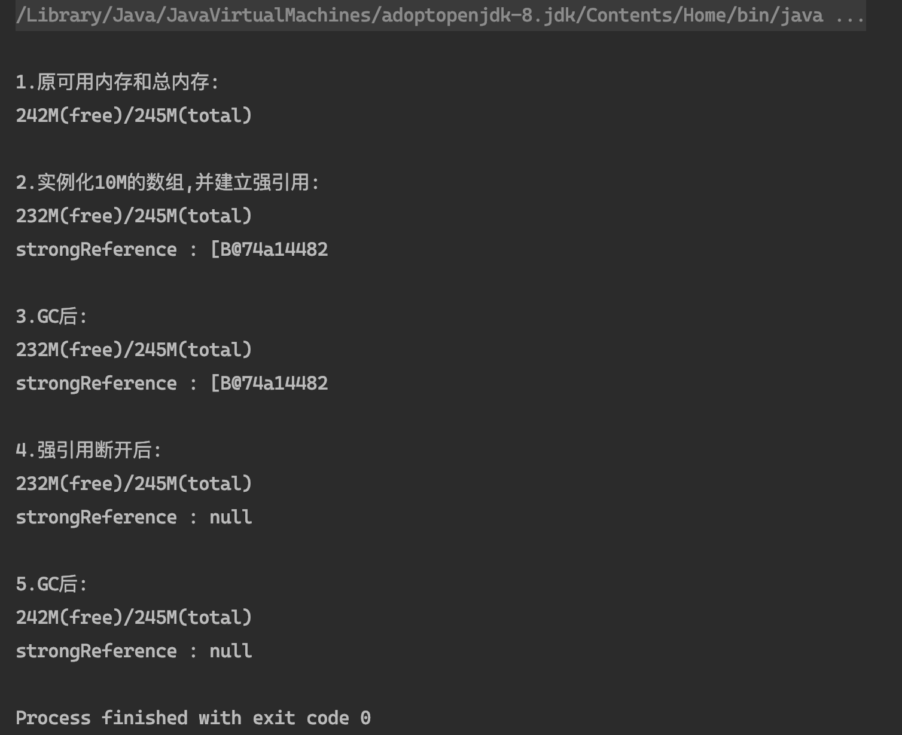
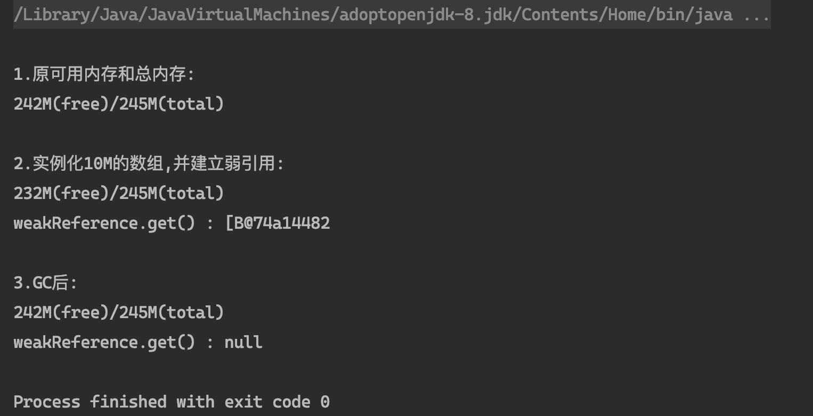
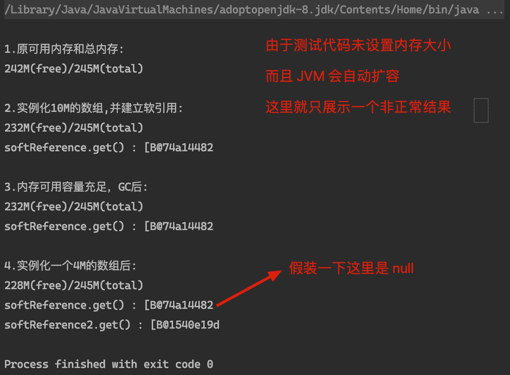
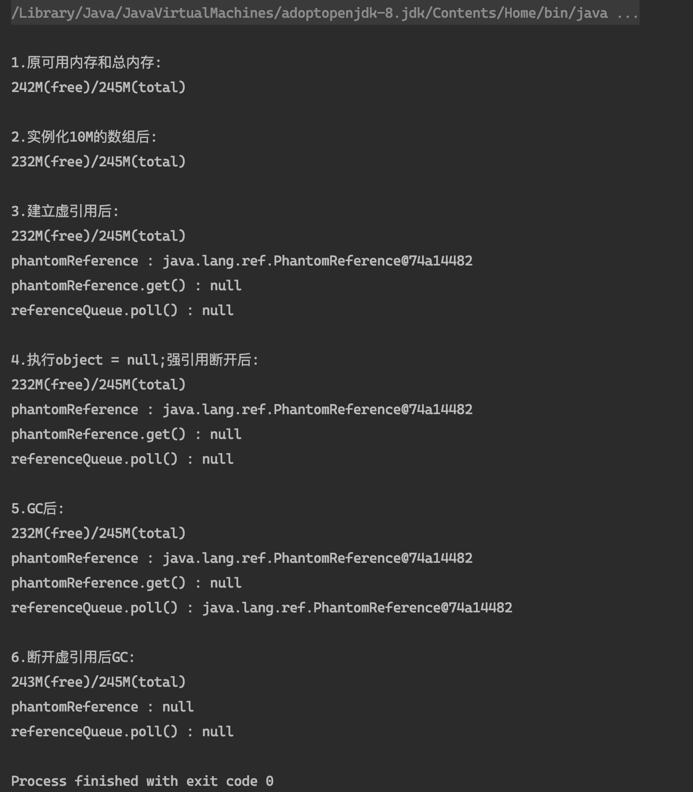

# 四种引用

Java 的内存回收不需要程序员负责，JVM 会在必要时启动 Java GC 完成垃圾回收。Java 以便我们控制对象的生存周期，提供给了我们四种引用方式，引用强度从强到弱分别为：**强引用**、**软引用**、**弱引用**、**虚引用**。 

## 强引用 StrongReference

**强引用**是 Java 的默认引用形式，使用时不需要显示定义。任何通过强引用所使用的对象不管系统资源有多紧张，Java GC 都不会主动回收具有强引用的对象。

```java
public class StrongReferenceTest {

    public static int M = 1024 * 1024;

    public static void printlnMemory(String tag) {
        Runtime runtime = Runtime.getRuntime();
        int M = StrongReferenceTest.M;
        System.out.println("\n" + tag + ":");
        System.out.println(runtime.freeMemory() / M + "M(free)/" + runtime.totalMemory() / M + "M(total)");
    }

    public static void main(String[] args) {
        StrongReferenceTest.printlnMemory("1.原可用内存和总内存");

        //实例化10M的数组并与strongReference建立强引用
        byte[] strongReference = new byte[10 * StrongReferenceTest.M];
        StrongReferenceTest.printlnMemory("2.实例化10M的数组,并建立强引用");
        System.out.println("strongReference : " + strongReference);

        System.gc();
        StrongReferenceTest.printlnMemory("3.GC后");
        System.out.println("strongReference : " + strongReference);

        //strongReference = null;后,强引用断开了
        strongReference = null;
        StrongReferenceTest.printlnMemory("4.强引用断开后");
        System.out.println("strongReference : " + strongReference);

        System.gc();
        StrongReferenceTest.printlnMemory("5.GC后");
        System.out.println("strongReference : " + strongReference);
    }
}
```

运行结果：



## 弱引用 WeakReference

如果一个对象只具有弱引用，无论内存充足与否，Java GC 后对象如果只有弱引用将会被自动回收。

```java
public class WeakReferenceTest {

    public static int M = 1024 * 1024;

    public static void printlnMemory(String tag) {
        Runtime runtime = Runtime.getRuntime();
        int M = WeakReferenceTest.M;
        System.out.println("\n" + tag + ":");
        System.out.println(runtime.freeMemory() / M + "M(free)/" + runtime.totalMemory() / M + "M(total)");
    }

    public static void main(String[] args) {
        WeakReferenceTest.printlnMemory("1.原可用内存和总内存");

        //创建弱引用
        WeakReference<Object> weakReference = new WeakReference<>(new byte[10 * WeakReferenceTest.M]);
        WeakReferenceTest.printlnMemory("2.实例化10M的数组,并建立弱引用");
        System.out.println("weakReference.get() : " + weakReference.get());

        System.gc();
        StrongReferenceTest.printlnMemory("3.GC后");
        System.out.println("weakReference.get() : " + weakReference.get());
    }
}
```

运行结果：



## 软引用 SoftReference

软引用和弱引用的特性基本一致， 主要的区别在于软引用在内存不足时才会被回收。如果一个对象只具有软引用，Java GC 在内存充足的时候不会回收它，内存不足时才会被回收。

```java
public class SoftReferenceTest {

    public static int M = 1024 * 1024;

    public static void printlnMemory(String tag) {
        Runtime runtime = Runtime.getRuntime();
        int M = StrongReferenceTest.M;
        System.out.println("\n" + tag + ":");
        System.out.println(runtime.freeMemory() / M + "M(free)/" + runtime.totalMemory() / M + "M(total)");
    }

    public static void main(String[] args) {
        SoftReferenceTest.printlnMemory("1.原可用内存和总内存");

        //建立软引用
        SoftReference<Object> softReference = new SoftReference<>(new byte[10 * SoftReferenceTest.M]);
        SoftReferenceTest.printlnMemory("2.实例化10M的数组,并建立软引用");
        System.out.println("softReference.get() : " + softReference.get());

        System.gc();
        SoftReferenceTest.printlnMemory("3.内存可用容量充足，GC后");
        System.out.println("softReference.get() : " + softReference.get());

        //实例化一个4M的数组,使内存不够用,并建立软引用
        //free=10M=4M+10M-4M,证明内存可用量不足时，GC后byte[10*m]被回收
        SoftReference<Object> softReference2 = new SoftReference<>(new byte[4 * SoftReferenceTest.M]);
        SoftReferenceTest.printlnMemory("4.实例化一个4M的数组后");
        System.out.println("softReference.get() : " + softReference.get());
        System.out.println("softReference2.get() : " + softReference2.get());
    }
}
```

运行结果：



## 虚引用 PhantomReference

从 **PhantomReference** 类的源代码可以知道，它的`get()`方法无论何时返回的都只会是 null。所以单独使用虚引用时，没有什么意义，需要和引用队列 **ReferenceQueue** 类联合使用。当执行 Java GC 时如果一个对象只有虚引用，就会把这个对象加入到与之关联的 **ReferenceQueue** 中。

```java
public class PhantomReferenceTest {

    public static int M = 1024 * 1024;

    public static void printlnMemory(String tag) {
        Runtime runtime = Runtime.getRuntime();
        int M = PhantomReferenceTest.M;
        System.out.println("\n" + tag + ":");
        System.out.println(runtime.freeMemory() / M + "M(free)/" + runtime.totalMemory() / M + "M(total)");
    }

    public static void main(String[] args) throws InterruptedException {

        PhantomReferenceTest.printlnMemory("1.原可用内存和总内存");
        byte[] object = new byte[10 * PhantomReferenceTest.M];
        PhantomReferenceTest.printlnMemory("2.实例化10M的数组后");

        //建立虚引用
        ReferenceQueue<Object> referenceQueue = new ReferenceQueue<>();
        PhantomReference<Object> phantomReference = new PhantomReference<>(object, referenceQueue);

        PhantomReferenceTest.printlnMemory("3.建立虚引用后");
        System.out.println("phantomReference : " + phantomReference);
        System.out.println("phantomReference.get() : " + phantomReference.get());
        System.out.println("referenceQueue.poll() : " + referenceQueue.poll());

        //断开byte[10*PhantomReferenceTest.M]的强引用
        object = null;
        PhantomReferenceTest.printlnMemory("4.执行object = null;强引用断开后");
        System.out.println("phantomReference : " + phantomReference);
        System.out.println("phantomReference.get() : " + phantomReference.get());
        System.out.println("referenceQueue.poll() : " + referenceQueue.poll());

        System.gc();
        PhantomReferenceTest.printlnMemory("5.GC后");
        System.out.println("phantomReference : " + phantomReference);
        System.out.println("phantomReference.get() : " + phantomReference.get());
        System.out.println("referenceQueue.poll() : " + referenceQueue.poll());

        //断开虚引用
        phantomReference = null;
        System.gc();
        PhantomReferenceTest.printlnMemory("6.断开虚引用后GC");
        System.out.println("phantomReference : " + phantomReference);
        System.out.println("referenceQueue.poll() : " + referenceQueue.poll());
    }
}
```

运行结果：



## 总结

| 引用类型 | GC 时 JVM 内存充足 | GC 时 JVM 内存不足 |
| -------- | ------------------ | ------------------ |
| 强引用   | 不被回收           | 不被回收           |
| 弱引用   | 被回收             | 被回收             |
| 软引用   | 不被回收           | 被回收             |