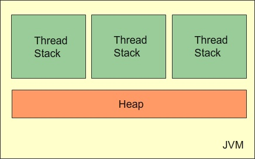
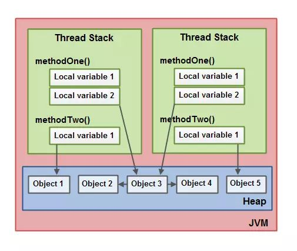
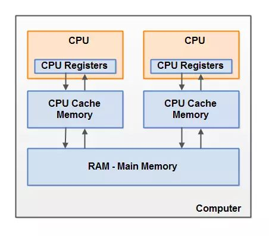
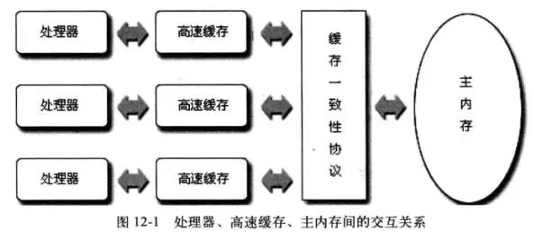
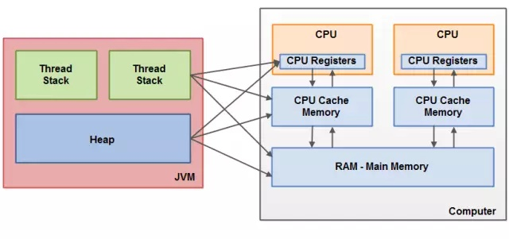
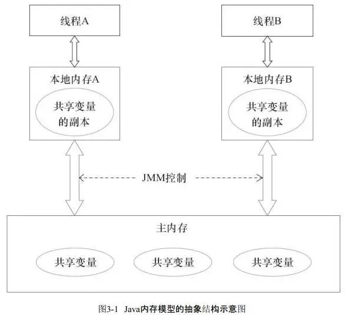
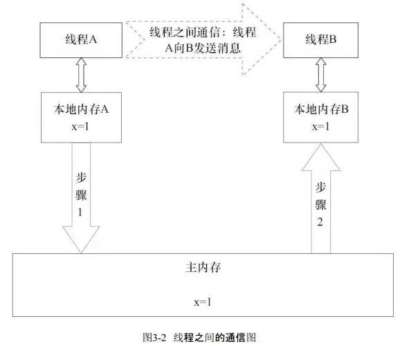
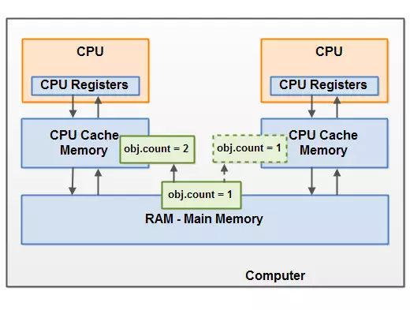
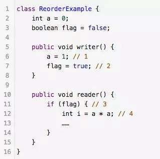
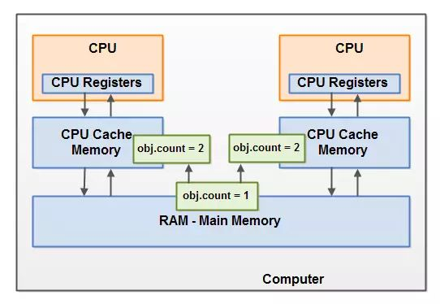

# JVM 内存模型

Java虚拟机规范中定义了Java内存模型（Java Memory Model，JMM），用于屏蔽掉各种硬件和操作系统的内存访问差异，以实现让Java程序在各种平台下都能达到一致的并发效果，JMM规范了Java虚拟机与计算机内存是如何协同工作的：规定了一个线程如何和何时可以看到由其他线程修改过后的共享变量的值，以及在必须时如何同步的访问共享变量。

Java内存模型（不仅仅是JVM内存分区）：调用栈和本地变量存放在线程栈上，对象存放在堆上。

## JMM 特点

1. 一个本地变量可能是原始类型，在这种情况下，它总是“呆在”线程栈上。
2. 一个本地变量也可能是指向一个对象的一个引用。在这种情况下，引用（这个本地变量）存放在线程栈上，但是对象本身存放在堆上。
3. 一个对象可能包含方法，这些方法可能包含本地变量。这些本地变量仍然存放在线程栈上，即使这些方法所属的对象存放在堆上。
4. 一个对象的成员变量可能随着这个对象自身存放在堆上。不管这个成员变量是原始类型还是引用类型。
5. 静态成员变量跟随着类定义一起也存放在堆上。
6. 存放在堆上的对象可以被所有持有对这个对象引用的线程访问。当一个线程可以访问一个对象时，它也可以访问这个对象的成员变量。如果两个线程同时调用同一个对象上的同一个方法，它们将会都访问这个对象的成员变量，但是每一个线程都拥有这个成员变量的私有拷贝。

## 硬件内存架构

现代硬件内存模型与 Java 内存模型有一些不同，理解内存模型架构以及 Java 内存模型如何与它协同工作也是非常重要的。

现代计算机硬件架构的简单图示：

* **CPU**：一个现代计算机通常由两个或者多个CPU。其中一些CPU还有多核。从这一点可以看出，在一个有两个或者多个CPU的现代计算机上同时运行多个线程是可能的。每个CPU在某一时刻运行一个线程是没有问题的。这意味着，如果你的 Java 程序是多线程的，在你的 Java 程序中每个 CPU 上一个线程可能同时（并发）执行。
* **CPU寄存器**：每个 CPU 都包含一系列的寄存器，它们是 CPU 内内存的基础。CPU 在寄存器上执行操作的速度远大于在主存上执行的速度。这是因为 CPU 访问寄存器的速度远大于主存。
* **高速缓存cache**：由于计算机的存储设备与处理器的运算速度之间有着几个数量级的差距，所以现代计算机系统都不得不加入一层读写速度尽可能接近处理器运算速度的高速缓存（Cache）来作为内存与处理器之间的缓冲：将运算需要使用到的数据复制到缓存中，让运算能快速进行，当运算结束后再从缓存同步回内存之中，这样处理器就无须等待缓慢的内存读写了。CPU访问缓存层的速度快于访问主存的速度，但通常比访问内部寄存器的速度还要慢一点。每个CPU可能有一个CPU缓存层，一些CPU还有多层缓存。在某一时刻，一个或者多个缓存行（cache lines）可能被读到缓存，一个或者多个缓存行可能再被刷新回主存。
* **内存**：一个计算机还包含一个主存。所有的CPU都可以访问主存。主存通常比CPU中的缓存大得多。

通常情况下，当一个CPU需要读取主存时，它会将主存的部分读到 CPU 缓存中。它甚至可能将缓存中的部分内容读到它的内部寄存器中，然后在寄存器中执行操作。当 CPU 需要将结果写回到主存中去时，它会将内部寄存器的值刷新到缓存中，然后在某个时间点将值刷新回主存。

## Java 内存模型和硬件内存架构之间的桥接

Java 内存模型与硬件内存架构之间存在差异。硬件内存架构没有区分线程栈和堆。对于硬件，所有的线程栈和堆都分布在主内存中。部分线程栈和堆可能有时候会出现在 CPU 缓存中和 CPU 内部的寄存器中。如下图所示：

从抽象的角度来看，JMM 定义了线程和主内存之间的抽象关系：

1. 线程之间的共享变量存储在主内存（Main Memory）中
2. 每个线程都有一个私有的本地内存（Local Memory），本地内存是 JMM 的一个抽象概念，并不真实存在，它涵盖了缓存、写缓冲区、寄存器以及其他的硬件和编译器优化。本地内存中存储了该线程以读/写共享变量的拷贝副本。
3. 从更低的层次来说，主内存就是硬件的内存，而为了获取更好的运行速度，虚拟机及硬件系统可能会让工作内存优先存储于寄存器和高速缓存中。
3. Java 内存模型中的线程的工作内存（working memory）是 cpu 的寄存器和高速缓存的抽象描述。而 JVM 的静态内存储模型（JVM 内存模型）只是一种对内存的物理划分而已，它只局限在内存，而且只局限在 JVM 的内存。

## JMM 模型下的线程间通信

线程间通信必须要经过主内存。

如果线程A与线程B之间要通信的话，必须要经历下面2个步骤：

1. 线程 A 把本地内存 A 中更新过的共享变量刷新到主内存中去。
2. 线程 B 到主内存中去读取线程 A 之前已更新过的共享变量。

关于主内存与工作内存之间的具体交互协议，即一个变量如何从主内存拷贝到工作内存、如何从工作内存同步到主内存之间的实现细节，Java 内存模型定义了以下八种操作来完成：

1. **lock（锁定）**：作用于主内存的变量，把一个变量标识为一条线程独占状态。
2. **unlock（解锁）**：作用于主内存变量，把一个处于锁定状态的变量释放出来，释放后的变量才可以被其他线程锁定。
3. **read（读取）**：作用于主内存变量，把一个变量值从主内存传输到线程的工作内存中，以便随后的 load 动作使用
4. **load（载入）**：作用于工作内存的变量，它把 read 操作从主内存中得到的变量值放入工作内存的变量副本中。
5. **use（使用）**：作用于工作内存的变量，把工作内存中的一个变量值传递给执行引擎，每当虚拟机遇到一个需要使用变量的值的字节码指令时将会执行这个操作。
6. **assign（赋值）**：作用于工作内存的变量，它把一个从执行引擎接收到的值赋值给工作内存的变量，每当虚拟机遇到一个给变量赋值的字节码指令时执行这个操作。
7. **store（存储）**：作用于工作内存的变量，把工作内存中的一个变量的值传送到主内存中，以便随后的 write 的操作。
8. **write（写入）**：作用于主内存的变量，它把 store 操作从工作内存中一个变量的值传送到主内存的变量中。

Java 内存模型还规定了在执行上述八种基本操作时，必须满足如下规则：

1. 如果要把一个变量从主内存中复制到工作内存，就需要按顺序地执行 read 和 load 操作，如果把变量从工作内存中同步回主内存中，就要按顺序地执行 store 和 write 操作。但 Java 内存模型只要求上述操作必须按顺序执行，而没有保证必须是连续执行。
2. 不允许 read 和 load、store 和 write 操作之一单独出现
3. 不允许一个线程丢弃它的最近 assign 的操作，即变量在工作内存中改变了之后必须同步到主内存中。
4. 不允许一个线程无原因地（没有发生过任何 assign 操作）把数据从工作内存同步回主内存中。
5. 一个新的变量只能在主内存中诞生，不允许在工作内存中直接使用一个未被初始化（load 或 assign）的变量。即就是对一个变量实施 use 和 store 操作之前，必须先执行过了 assign 和 load 操作。
6. 一个变量在同一时刻只允许一条线程对其进行 lock 操作，但 lock 操作可以被同一条线程重复执行多次，多次执行 lock 后，只有执行相同次数的 unlock 操作，变量才会被解锁。lock 和 unlock 必须成对出现
7. 如果对一个变量执行 lock 操作，将会清空工作内存中此变量的值，在执行引擎使用这个变量前需要重新执行 load 或 assign 操作初始化变量的值
8. 如果一个变量事先没有被 lock 操作锁定，则不允许对它执行 unlock 操作；也不允许去 unlock 一个被其他线程锁定的变量。

## Java 内存模型解决的问题

当对象和变量被存放在计算机中各种不同的内存区域中时，就可能会出现一些具体的问题。Java 内存模型建立所围绕的问题：在多线程并发过程中，如何处理多线程读同步问题与可见性（多线程缓存与指令重排序）、多线程写同步问题与原子性（多线程竞争 race condition）。

### 1、多线程读同步与可见性

**可见性（共享对象可见性）**：线程对共享变量修改的可见性。当一个线程修改了共享变量的值，其他线程能够立刻得知这个修改

如果两个或者更多的线程在没有正确的使用`volatile`声明或者同步的情况下共享一个对象，一个线程更新这个共享对象可能对其它线程来说是不可见的：共享对象被初始化在主存中。跑在 CPU 上的一个线程将这个共享对象读到 CPU 缓存中，然后修改了这个对象。只要 CPU 缓存没有被刷新回主存，对象修改后的版本对跑在其它 CPU 上的线程都是不可见的。这种方式可能导致每个线程拥有这个共享对象的私有拷贝，每个拷贝停留在不同的 CPU 缓存中。

下图示意了这种情形。跑在左边 CPU 的线程拷贝这个共享对象到它的CPU缓存中，然后将 count 变量的值修改为 2。这个修改对跑在右边 CPU 上的其它线程是不可见的，因为修改后的 count 的值还没有被刷新回主存中去。

解决方法：

1. 使用`volatile`关键字修饰变量可以保证该变量每次修改后都会立即同步到主存，每次被使用前都立即从主内存刷新。
2. 使用`synchronized`关键字，同步块还可以保证代码块中所有被访问的变量将会从主存中读入，当线程退出同步代码块时，所有被更新的变量都会被刷新回主存中去。
3. 使用`final`关键字，构造器中一旦初始化完成即不可变，不会有可见性问题。

#### 重排序导致的可见性问题

flag 变量是个标记，用来标识变量 a 是否已被写入。这里假设有两个线程 A 和 B ，A 首先执行`writer()`方法，随后 B 线程接着执行`reader()`方法。线程 B 在执行操作4时，能否看到线程 A 在操作 1 对共享变量 a 的写入呢？**不一定能看到**。

由于操作 1 和操作 2 没有数据依赖关系，编译器和处理器可以对这两个操作重排序；同样，操作 3 和操作 4 没有数据依赖关系，编译器和处理器也可以对这两个操作重排序。

Java 语言提供了`volatile`和`synchronized`两个关键字来保证线程之间操作的有序性：

* `volatile`关键字本身就包含了禁止指令重排序的语义
* `synchronized`则是由“一个变量在同一个时刻只允许一条线程对其进行 lock 操作”这条规则获得的，这个规则决定了持有同一个锁的两个同步块只能串行地进入

### 2、多线程写同步与原子性

多线程竞争（Race Conditions）问题：当读，写和检查共享变量时出现竞争。

线程 A 和线程 B 都从主存读取了变量 count 到 CPU 缓存中，现在线程 A 和线程 B 都对 count 执行了 +1 操作，如果按顺序执行主存中的 count 将 +2。但两次增加没有同步加锁执行，一旦线程竞争将有可能 A 中的 count 变成 2 还未同步到主存，B 中的 count 变成 2，然后都同步到主存中，此时主存中的 count 将是 2。

#### 使用原子性保证多线程写同步问题

**原子性**：指一个操作是按原子的方式执行的。要么该操作不被执行；要么以原子方式执行，即执行过程中不会被其它线程中断。

* 我们大致可以认为基本数据类型变量、引用类型变量、声明为`volatile`的任何类型变量的访问读写是具备原子性的，这些类型变量的读、写天然具有原子性，但类似于 “基本变量++” / “volatile++” 这种复合操作并没有原子性。
* `synchronized`关键字，使用同步块可以保证操作的原子性。