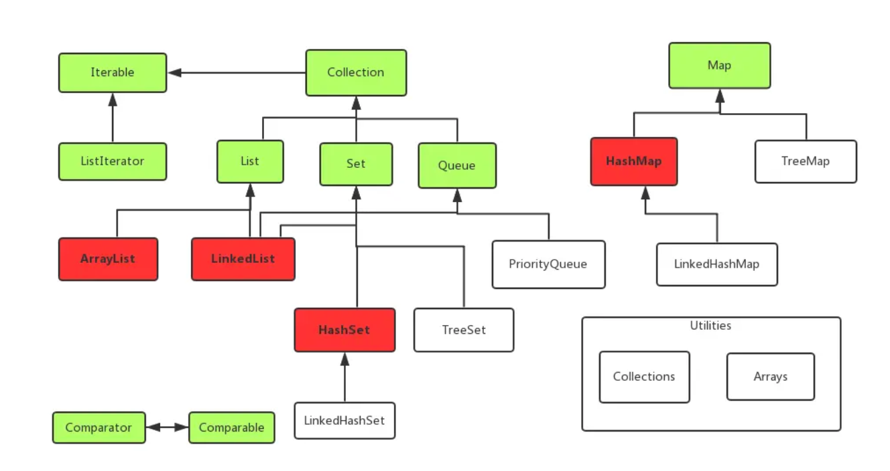

# 集合类

Java 集合的用途是保存对象

## Collection

### List

有序集合

* **ArrayList**: 数组实现的 List，随机访问性能好，插入移除元素较慢。
* **LinkedList**: 链表实现的 List，随机访问较慢，插入、移除效率高，顺序访问效率好。提供了更多特性。
* **Vector**: 同步版的 ArrayList，线程安全但开销较大。
* **Stack**: 通常是"后进先出"(LIFO)的容器，LinkedList 封装之后也可以作为 Stack 使用。

### Queue

先进先出(FIFO)的容器，从容器一端放入元素，另一端取出元素，且放入顺序与取出顺序相同。

* **LinkedList**: 链表队列。
* **PriorityQueue**: 优先级队列，根据传入的 Comparator 的规则决定，取出时取出优先级最高的元素(也有可能是插入时就排序)。

### Set

无重复元素的集合

* **HashSet**: 使用散列，对快速查找优化的 Set。
* **LinkedHashSet**: 保存了插入顺序的 HashSet。
* **TreeSet**: 使用红黑树的 Set。

## Map

保存了映射关系的数据结构

* **HashMap**: 散列实现的对快速查找优化的 Map。
* **HashTable**: 同步版的 HashMap，线程安全但开销较大。
* **TreeMap**: 红黑树实现的 Map。