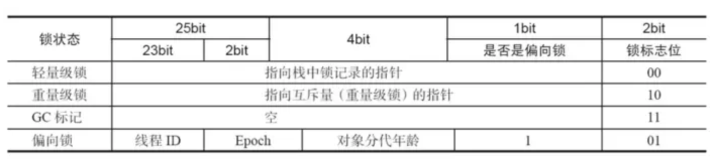
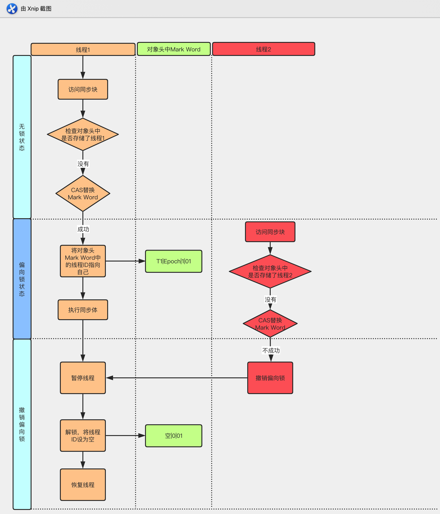
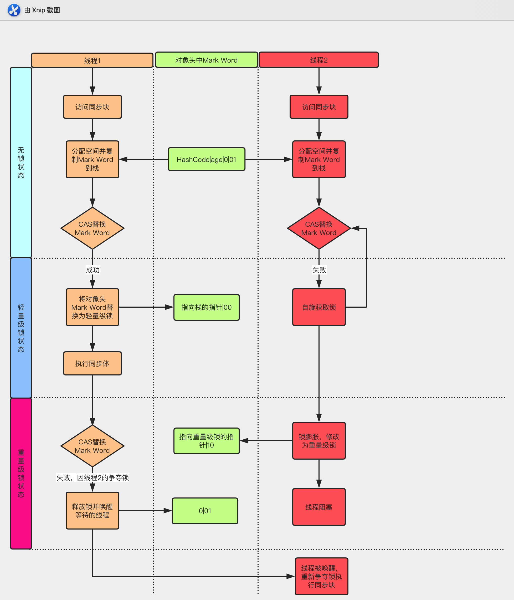

# synchronized 关键字

## 一 使用场景

| 分类   | 具体分类     | 被锁的对象   | 伪代码                                        |
| ------ | ------------ | ------------ | --------------------------------------------- |
| 方法   | 实例方法     | 类的实例对象 | `public synchronized void method() {}`        |
|        | 静态方法     | 类对象       | `public static synchronized void method() {}` |
| 代码块 | 实例对象     | 类的实例对象 | `synchronized (this) {}`                      |
|        | class 对象   | 类对象       | `synchronized (Demo.class) {}`                |
|        | 任意实例对象 | 实例对象     | ```synchronized (lock) {}```                  |

## 二 优化

使用 synchronized 关键字，在同一时刻只有一个线程能够获得对象的监视器（monitor），从而进入到同步代码块或者同步方法之中，即表现为**互斥性（排它性）**。这样同时也导致了效率低下。

### 2.1 CAS 操作

#### 2.1.1 什么是 CAS?

使用锁时，线程获取锁是一种**悲观锁策略**，即假设每一次执行临界区代码都会产生冲突，所以当前线程获取到锁的时候同时也会阻塞其他线程获取该锁。而 CAS 操作（又称为无锁操作）是一种**乐观锁策略**，它假设所有线程访问共享资源的时候不会出现冲突，既然不会出现冲突自然而然就不会阻塞其他线程的操作。因此，线程就不会出现阻塞停顿的状态。那么，如果出现冲突了怎么办？无锁操作是使用 **CAS(compare and swap)** 又叫做比较交换来鉴别线程是否出现冲突，出现冲突就重试当前操作直到没有冲突为止。

#### 2.1.2 CAS 的操作过程

CAS 比较交换的过程可以通俗的理解为 CAS(V,O,N)，包含三个值分别为：**V 内存地址存放的实际值；O 预期的值（旧值）；N 更新的新值**。当 V 和 O 相同时，也就是说旧值和内存中实际的值相同表明该值没有被其他线程更改过，即该旧值 O 就是目前来说最新的值了，自然而然可以将新值 N 赋值给 V。反之，V 和 O 不相同，表明该值已经被其他线程改过了则该旧值 O 不是最新版本的值了，所以不能将新值 N 赋给 V，返回 V 即可。当多个线程使用 CAS 操作一个变量时，只有一个线程会成功，并成功更新，其余会失败。失败的线程会重新尝试，当然也可以选择挂起线程

CAS 的实现需要硬件指令集的支撑，在 JDK1.5 后虚拟机才可以使用处理器提供的 **CMPXCHG** 指令实现。

> Synchronized VS CAS

元老级的 Synchronized(未优化前) 最主要的问题是：在存在线程竞争的情况下会出现线程阻塞和唤醒锁带来的性能问题，因为这是一种互斥同步（阻塞同步）。而 CAS 并不是武断的间线程挂起，当 CAS 操作失败后会进行一定的尝试，而非进行耗时的挂起唤醒的操作，因此也叫做非阻塞同步。这是两者主要的区别。

#### 2.1.4 CAS 的问题

**1. ABA 问题** 因为 CAS 会检查旧值有没有变化，这里存在这样一个有意思的问题。比如一个旧值 A 变为了成 B，然后再变成 A，刚好在做 CAS 时检查发现旧值并没有变化依然为 A，但是实际上的确发生了变化。解决方案可以沿袭数据库中常用的乐观锁方式，添加一个版本号可以解决。原来的变化路径 A->B->A 就变成了 1A->2B->3C。java 这么优秀的语言，当然在 java 1.5 后的 atomic 包中提供了 AtomicStampedReference 来解决 ABA 问题，解决思路就是这样的。

**2. 自旋时间过长**

使用 CAS 时非阻塞同步，也就是说不会将线程挂起，会自旋（无非就是一个死循环）进行下一次尝试，如果这里自旋时间过长对性能是很大的消耗。如果 JVM 能支持处理器提供的 pause 指令，那么在效率上会有一定的提升。

**3. 只能保证一个共享变量的原子操作**

当对一个共享变量执行操作时 CAS 能保证其原子性，如果对多个共享变量进行操作, CAS 就不能保证其原子性。有一个解决方案是利用对象整合多个共享变量，即一个类中的成员变量就是这几个共享变量。然后将这个对象做 CAS 操作就可以保证其原子性。atomic 中提供了 AtomicReference 来保证引用对象之间的原子性。

### 2.2 JAVA 对象头

在同步的时候是获取对象的监视器 monitor，即获取到对象的锁。那么对象的锁怎么理解？无非就是类似对对象的一个标志，那么这个标志就是存放在 Java 对象的对象头。Java 对象头里的 Mark Word 里默认的存放的对象的 Hashcode, 分代年龄和锁标记位。32 位 JVM Mark Word 默认存储结构为：

| 锁状态   | 25 bit          | 4 bit        | 1 bit 是否是偏向锁 | 2 bit 标志位 |
| -------- | --------------- | ------------ | ------------------ | ------------ |
| 无锁状态 | 对象的 hashCode | 对象分代年龄 | 0                  | 01           |

Java SE 1.6 中，锁一共有 4 种状态，级别从低到高依次是：**无锁状态、偏向锁状态、轻量级锁状态和重量级锁状态**，这几个状态会随着竞争情况逐渐升级。**锁可以升级但不能降级**，意味着偏向锁升级成轻量级锁后不能降级成偏向锁。这种锁升级却不能降级的策略，目的是为了提高获得锁和释放锁的效率。对象的 MarkWord 变化为下图：



### 2.3 偏向锁

HotSpot 的作者经过研究发现，大多数情况下，锁不仅不存在多线程竞争，而且总是由同一线程多次获得，为了让线程获得锁的代价更低而引入了**偏向锁**。

#### 偏向锁的获取

当一个线程访问同步块并获取锁时，会在**对象头**和**栈帧中的锁记录**里存储锁偏向的线程 ID，以后该线程在进入和退出同步块时不需要进行 CAS 操作来加锁和解锁，只需简单地测试一下对象头的 Mark Word 里是否存储着指向当前线程的偏向锁。如果测试成功，表示线程已经获得了锁。如果测试失败，则需要再测试一下 Mark Word 中偏向锁的标识是否设置成 1（表示当前是偏向锁）：如果没有设置，则使用 CAS 竞争锁；如果设置了，则尝试使用 CAS 将对象头的偏向锁指向当前线程。

#### 偏向锁的撤销

偏向锁使用了一种**等到竞争出现才释放锁**的机制，所以当其他线程尝试竞争偏向锁时，持有偏向锁的线程才会释放锁。

下图线程 1 展示了偏向锁获取的过程，线程 2 展示了偏向锁撤销的过程。



### 2.4 轻量级锁

#### 加锁

线程在执行同步块之前，JVM 会先在当前线程的栈桢中**创建用于存储锁记录的空间**，并将对象头中的 Mark Word 复制到锁记录中，官方称为 **Displaced Mark Word**。然后线程尝试使用 CAS **将对象头中的 Mark Word 替换为指向锁记录的指针**。如果成功，当前线程获得锁，如果失败，表示其他线程竞争锁，当前线程便尝试使用自旋来获取锁。

#### 解锁

轻量级解锁时，会使用原子的 CAS 操作将 Displaced Mark Word 替换回到对象头，如果成功，则表示没有竞争发生。如果失败，表示当前锁存在竞争，锁就会膨胀成重量级锁。下图是两个线程同时争夺锁，导致锁膨胀的流程图。



因为自旋会消耗 CPU，为了避免无用的自旋（比如获得锁的线程被阻塞住了），一旦锁升级成重量级锁，就不会再恢复到轻量级锁状态。当锁处于这个状态下，其他线程试图获取锁时，都会被阻塞住，当持有锁的线程释放锁之后会唤醒这些线程，被唤醒的线程就会进行新一轮的夺锁之争。

### 2.5 各种锁的比较

|  锁类型  |                             优点                             |                      缺点                      |              适用场景              |
| :------: | :----------------------------------------------------------: | :--------------------------------------------: | :--------------------------------: |
|  偏向锁  | 加锁和解锁不需要额外的消耗，和执行非同步方法相比仅存在纳秒级差距 | 如果线程间存在锁竞争，会带来额外的锁撤销的消耗 |  适用于只有一个线程访问同步块场景  |
| 轻量级锁 |           竞争的线程不会阻塞，提高了程序的响应速度           | 如果始终得不到锁竞争的线程，使用自旋会消耗 CPU | 追求响应时间，同步块执行速度非常快 |
| 重量级锁 |               线程竞争不使用自旋，不会消耗 CPU               |             线程阻塞，响应时间缓慢             |   追求吞吐量，同步块执行速度较长   |

