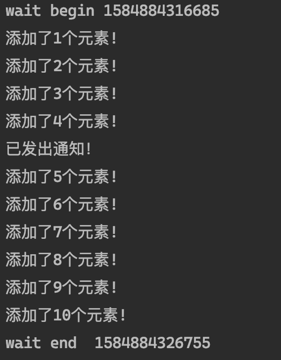
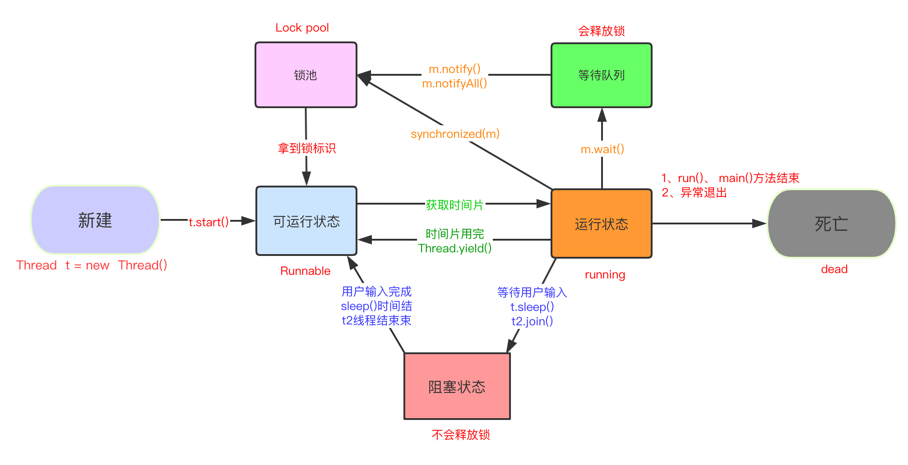

# 等待/通知机制

## 1 介绍

等待 / 通知机制，是指一个线程 A 调用了对象 O 的`wait()`方法进入等待状态，而另一个线程 B 调用了对象 O 的 `notify()/notifyAll()`方法，线程 A 收到通知后退出等待队列，进入可运行状态，进而执行后续操作。上诉两个线程通过对象 O 来完成交互，而对象上的 **wait() 方法**和**notify()/notifyAll() 方法**的关系就如同开关信号一样，用来完成等待方和通知方之间的交互工作。

相关方法：

| 方法                          | 描述                                                         |
| ----------------------------- | ------------------------------------------------------------ |
| notify()                      | 随机唤醒等待队列中等待同一共享资源的 **“一个线程”**，并使该线程退出等待队列，进入可运行状态，也就是 **notify() 方法仅通知 “一个线程”** |
| notifyAll()                   | 使所有正在等待队列中等待同一共享资源的 **“全部线程”** 退出等待队列，进入可运行状态。此时，优先级最高的那个线程最先执行，但也有可能是随机执行，这取决于 JVM 虚拟机的实现 |
| wait()                        | 使调用该方法的线程释放共享资源锁，然后从运行状态退出，进入等待队列，直到被再次唤醒 |
| wait(long timeout)            | 超时等待一段时间，这里的参数时间是毫秒，也就是等待长达 n 毫秒，如果没有通知就超时返回 |
| wait(long timeout, int nanos) | 对于超时时间更细力度的控制，可以达到纳秒                     |

## 2 实现

### 2.1 例子

MyList.java

```java
public class MyList {
    private static List<String> list = new ArrayList<String>();

    public static void add() {
        list.add("anyString");
    }

    public static int size() {
        return list.size();
    }
}
```

ThreadA.java

```java
public class ThreadA extends Thread {

    private Object lock;

    public ThreadA(Object lock) {
        super();
        this.lock = lock;
    }

    @Override
    public void run() {
        try {
            synchronized (lock) {
                if (MyList.size() != 5) {
                    System.out.println("wait begin "
                            + System.currentTimeMillis());
                    lock.wait();
                    System.out.println("wait end  "
                            + System.currentTimeMillis());
                }
            }
        } catch (InterruptedException e) {
            e.printStackTrace();
        }
    }
}

```

ThreadB.java

```java
public class ThreadB extends Thread {
    private Object lock;

    public ThreadB(Object lock) {
        super();
        this.lock = lock;
    }

    @Override
    public void run() {
        try {
            synchronized (lock) {
                for (int i = 0; i < 10; i++) {
                    MyList.add();
                    if (MyList.size() == 5) {
                        lock.notify();
                        System.out.println("已发出通知！");
                    }
                    System.out.println("添加了" + (i + 1) + "个元素!");
                    Thread.sleep(1000);
                }
            }
        } catch (InterruptedException e) {
          e.printStackTrace();
        }
    }
}
```

Run.java

```java
public class Run {

    public static void main(String[] args) {
        try {
            Object lock = new Object();

            ThreadA a = new ThreadA(lock);
            a.start();

            Thread.sleep(50);

            ThreadB b = new ThreadB(lock);
            b.start();
        } catch (InterruptedException e) {
            e.printStackTrace();
        }
    }
}
```



### 2.2 线程的基本状态

上面表格里的 API 可以改变线程对象的状态。如下图所示：



* **新建 (new)**：新创建了一个线程对象。

* **可运行 (runnable)**：线程对象创建后，其他线程 (比如 main 线程）调用了该对象的 start() 方法。该状态的线程位于可运行线程池中，等待被线程调度选中，获 取 cpu 的使用权。

* **运行 (running)**：可运行状态 (runnable) 的线程获得了 cpu 时间片（timeslice），执行程序代码。

* **阻塞 (block)**：阻塞状态是指线程因为某种原因放弃了 cpu 使用权，也即让出了 cpu timeslice，暂时停止运行。直到线程进入可运行 (runnable) 状态，才有 机会再次获得 cpu timeslice 转到运行 (running) 状态。阻塞的情况分三种：

  (一). **等待阻塞**：运行 (running) 的线程执行 o.wait()方法，JVM 会把该线程放 入等待队列 (waitting queue) 中。

  (二). **同步阻塞**：运行 (running) 的线程在获取对象的同步锁时，若该同步锁 被别的线程占用，则 JVM 会把该线程放入锁池 (lock pool) 中。

  (三). **其他阻塞**: 运行 (running) 的线程执行 Thread.sleep(long ms)或 t.join()方法，或者发出了 I/O 请求时，JVM 会把该线程置为阻塞状态。当 sleep()状态超时 join()等待线程终止或者超时、或者 I/O 处理完毕时，线程重新转入可运行 (runnable) 状态。

* **死亡 (dead)**：线程 run()、main() 方法执行结束，或者因异常退出了 run() 方法，则该线程结束生命周期。死亡的线程不可再次复生。

### 2.3 wait 释放锁

wait 方法会释放锁进入等待队列。

### 2.4 notify 不会释放锁

必须执行完 notify() 方法所在的 synchronized 代码块后才释放。

### 2.5 interrupt wait 方法

当线程呈 wait 状态时，对线程对象调用 interrupt 方法会出现 InterrupedException 异常。