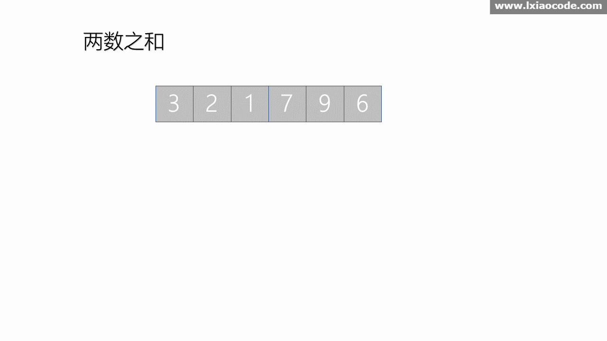

# 两数之和

## 题目

给定一个整数数组 `nums` 和一个目标值 `target`，请你在该数组中找出和为目标值的那 **两个** 整数，并返回他们的数组下标。

你可以假设每种输入只会对应一个答案。但是，你不能重复利用这个数组中同样的元素。

## 示例

> 给定 nums = [2, 7, 11, 15], target = 9
>
> 因为 nums[0] + nums[1] = 2 + 7 = 9
> 所以返回 [0, 1]

## 解答

### Kotlin 版

使用哈希表，用值做键，index 做值，时间复杂度 O(n)，空间复杂度 O(n)，使用 `containsKey` 判断键是否存在。

#### 图示



#### 代码

```kotlin
class Solution {
    fun twoSum(nums: IntArray, target: Int): IntArray {
        val map = hashMapOf<Int, Int>()
        val arr = IntArray(2)
        nums.forEachIndexed { index, i ->
            val result = target - i
            if (map.containsKey(result)) {
                arr[0] = map[result]!!
                arr[1] = index
                return arr
            } else {
                map[i] = index
            }
        }
        return arr
    }
}
```

