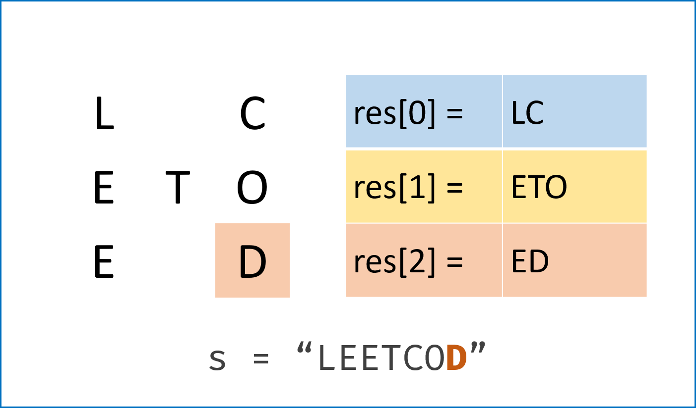

# Z 字形变换

## 题目

将一个给定字符串根据给定的行数，以从上往下、从左到右进行 Z 字形排列。

比如输入字符串为 `"LEETCODEISHIRING"` 行数为 3 时，排列如下：

> L   C   I   R
> E T O E S I I G
> E   D   H   N

之后，你的输出需要从左往右逐行读取，产生出一个新的字符串，比如：`"LCIRETOESIIGEDHN"`。

请你实现这个将字符串进行指定行数变换的函数：

```java
string convert(string s, int numRows);
```

## 示例

### 示例1

> **输入:** s = "LEETCODEISHIRING", numRows = 3
> **输出:** "LCIRETOESIIGEDHN"

### 示例 2

> **输入:** s = "LEETCODEISHIRING", numRows = 4
> **输出:** "LDREOEIIECIHNTSG"
> **解释:**
>
> L     D     R
> E   O E   I I
> E C   I H   N
> T     S     G

## 解答

### 数组存储

使用数组存储横向文字。



```kotlin
class Solution {
    fun convert(s: String, numRows: Int): String {
        if (numRows < 2) return s
        // 向下是 +1，向上是 -1
        var flag = -1
        var line = 0
        val rows = (0..numRows).mapTo(mutableListOf()) { StringBuilder() }
        for (c in s.toCharArray()) {
            rows[line].append(c)
            if (line == 0 || line == numRows - 1) flag = -flag
            line += flag
        }
        val first = rows[0]
        for (i in 1..rows.lastIndex) {
            first.append(rows[i])
        }
        return first.toString()
    }
}
```