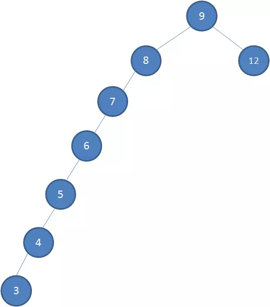
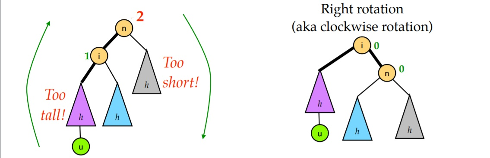
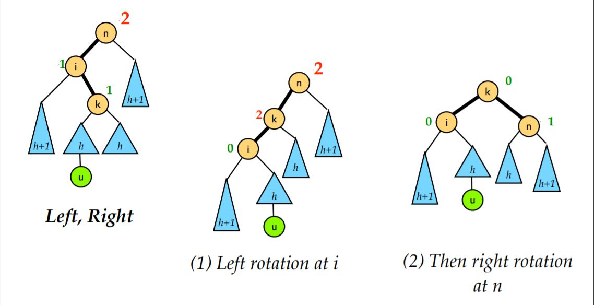

# 二叉树

## 二叉查找树

二叉查找树是指一棵空树或者具有下列性质的二叉树：

1. 若任意节点的左子树不空，则左子树上所有节点的值均小于它的根节点的值；
2. 若任意节点的右子树不空，则右子树上所有节点的值均大于或等于它的根节点的值；
3. 任意节点的左、右子树也分别为二叉查找树；

其结构如图所示：

一个严格按照规则排列的二叉查找树，我们在查找对应元素的时候，就可以按照如下规则查询元素：

1. 从根节点开始
2. 如果值小于节点值则走到左子节点；如果值大于节点值则走到右子节点；如果相等则返回；
3. 重复步骤2直到找到相等的节点；

可以看出只要我们在插入数据的时候保持满足该规则那么查找数据时时间复杂度就是 O(log n)

但二叉查找树有一个弊端，如果我们恰好在插入数据时插入了有顺序的数据，那么二叉查找树可能会退化为链表：

此时二叉查找树的查询性能就从 O(log n) 降低到了 O(n)

## 平衡二叉树

上述的二叉查找树某些情况下可能造成不平衡，甚至退化为链表的状况。为了解决这个问题，我们可以在修改数据的时候调整树结构，将其左右深度调整为差不多的情况，使其平衡。

**AVL树**是一种常见的平衡二叉树，其在二叉查找树的基础上添加了一个定义：

> 任一节点对应的两棵子树的最大高度差为1。

那么为了满足这个条件，在二叉树里插入数据之后我们还需要对树结构做一定的调整，AVL树的调整方式有两种：左旋和右旋。

### 左旋

### 右旋

### 需要平衡的四种情况

#### LL 型

所谓 LL 型就是上图左边那种情况，即因为在根节点的左孩子的左子树添加了新节点，导致根节点的平衡因子变为 +2，二叉树失去平衡。对于这种情况，对节点 n 右旋一次即可。

#### RR 型

RR 型的情况和 LL 型完全对称, 只需对节点n进行一次左旋即可修正。

#### LR 型

LR 就是将新的节点插入到了 n 的左孩子的右子树上导致的不平衡的情况。这时我们需要的是先对 i 进行一次左旋再对 n 进行一次右旋。

#### RL 型

RL 就是将新的节点插入到了 n 的右孩子的左子树上导致的不平衡的情况。这时我们需要的是先对 i 进行一次右旋再对 n 进行一次左旋。

**AVL树**的可视化可以参照这个[网址](https://www.cs.usfca.edu/~galles/visualization/AVLtree.html)

不难看出因为**AVL树**本身严苛的限制条件可能在插入、删除数据的时候频繁触发调整树结构的操作，那有没有一种限制不那么严苛的树，又不会导致树结构退化为链表的选择呢？

## 红黑树

红黑树是一种含有红黑结点并能自平衡的二叉查找树。它必须满足下面性质：

1. 每个节点要么是黑色，要么是红色；
2. 根节点是黑色；
3. 每个叶子节点（NIL）是黑色；
4. 每个红色结点的两个子结点一定都是黑色；
5. 任意一结点到每个叶子结点的路径都包含数量相同的黑结点。

红黑树保持平衡的调整方式有三种：**左旋**、**右旋**和**变色**。

