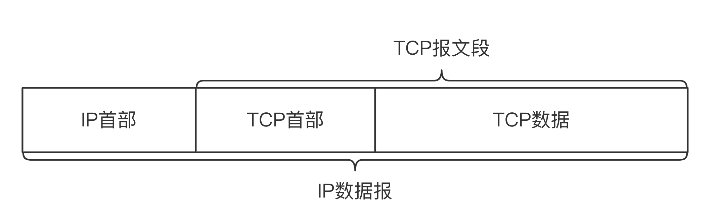
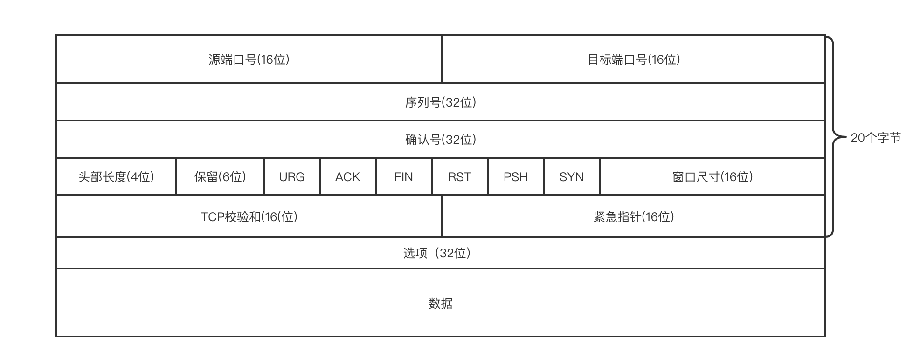
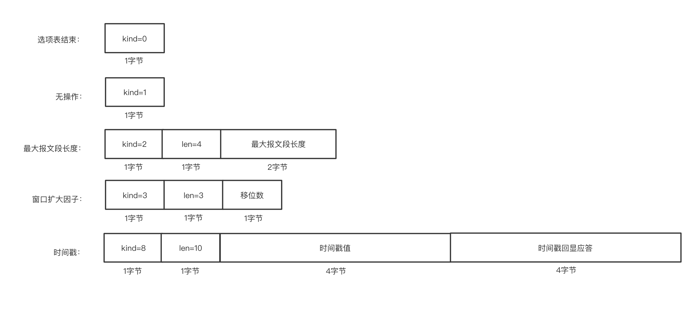
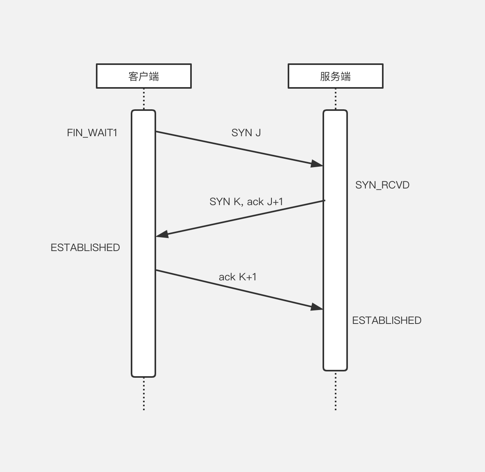
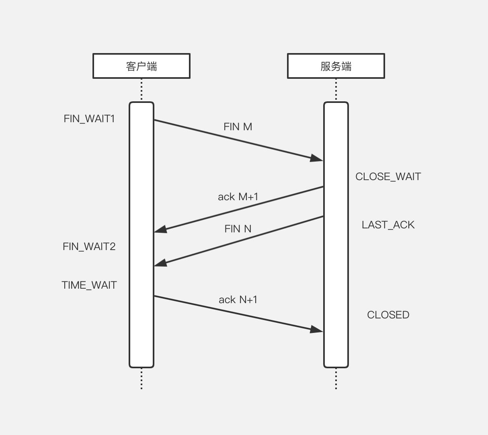
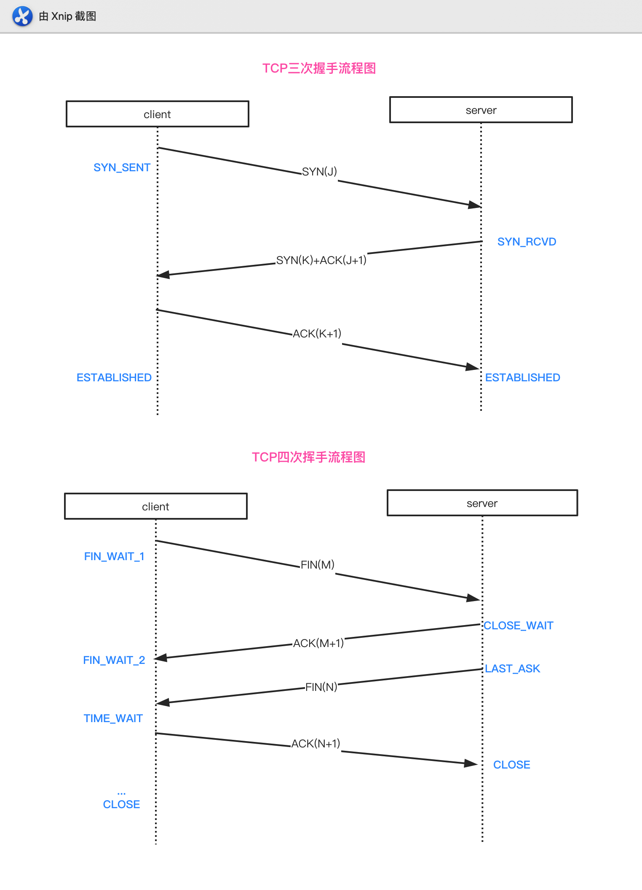
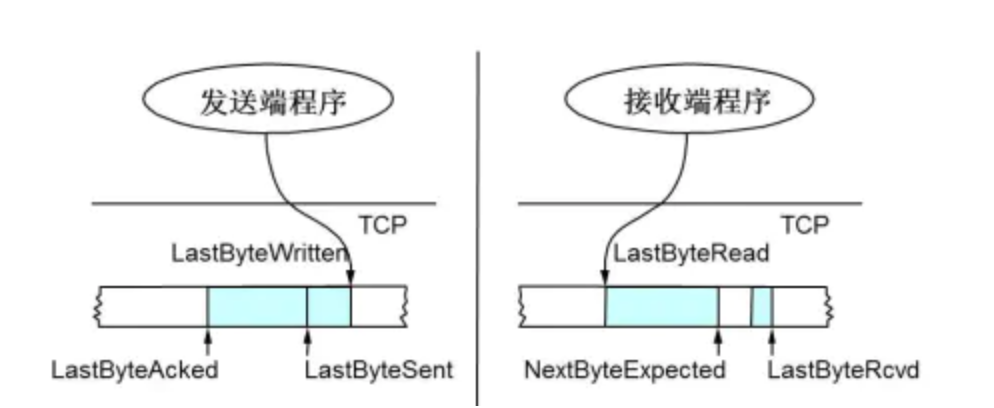
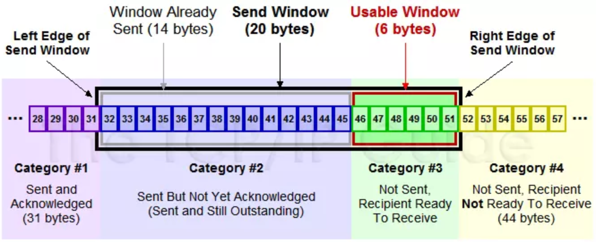
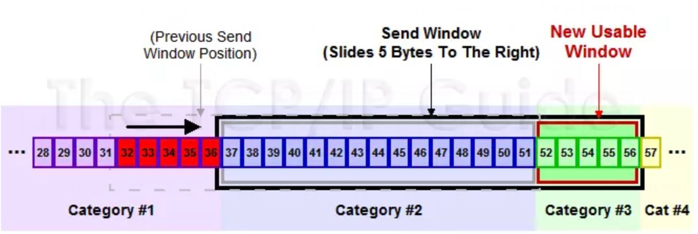
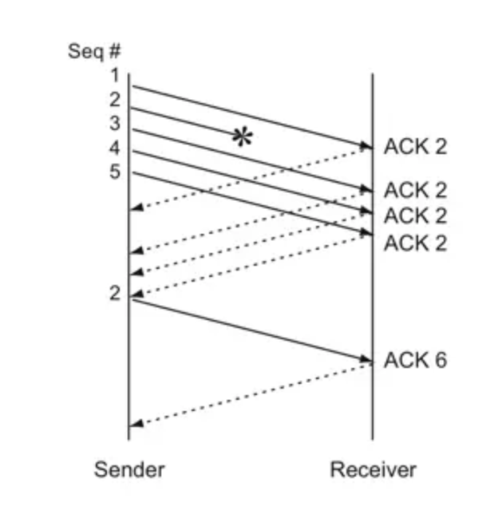

# TCP 协议详解

## 前言

小到基于应用层做网络开发，大到生活中无处不在的网络。我们在享受这个便利的时候，没有人会关心它如此牢固的底层基石是如何搭建的。而这些基石中很重要的一环就是 tcp 协议。翻看一下 “三次握手” 和“四次挥手”，本以为这就是 tcp 了，其实不然。它仅仅解决了连接和关闭的问题，传输的问题才是 tcp 协议更重要，更难，更复杂的问题。回头看 tcp 协议的原理，会发现它为了承诺上层数据传输的“可靠”，不知要应对多少网络中复杂多变的情况。简单直白列举一下：

- 怎么保证数据都是可靠呢？--- 连接确认！关闭确认！收到数据确认！各种确认！！
- 因为网络或其他原因，对方收不到数据怎么办？-- 超时重试
- 网络情况千变万化，超时时间怎么确定？-- 根据 RTT 动态计算
- 反反复复，不厌其烦的重试，导致网络拥塞怎么办？--- 慢启动，拥塞避免，快速重传，快速恢复
- 发送速度和接收速度不匹配怎么办？-- 滑动窗口
- 滑动窗口滑的过程中，他一直告诉我处理不过来了，不让传数据了怎么办？--ZWP
- 滑动窗口滑的过程中，他处理得慢，就理所当然的每次让我发很少的数据，导致网络利用率很低怎么办？---Nagle

其中任何一个小环节，都凝聚了无数的算法，我们没有能力理解各个算法的实现，但是需要了解下 tcp 实现者的思路历程。

梳理完所有内容，大概可以知道： 

* tcp 提供哪些机制保证了数据传输的可靠性？
* tcp 连接的 “三次握手” 和关闭的 “四次挥手” 流程是怎么样的？
* tcp 连接和关闭过程中，状态是如何变化的？
* tcp 头部有哪些字段，分别用来做什么的？
* tcp 的滑动窗口协议是什么?
* 超时重传的机制是什么？
* 如何避免传输拥塞？

## 一. 概述

### 1. TCP 连接的特点

- 提供面向连接的，可靠的字节流服务
- 为上层应用层提供服务，不关心具体传输的内容是什么，也不知道是二进制流，还是 ascii 字符。

### 2. TCP 的可靠性如何保证

* 分块传送：数据被分割成最合适的数据块（UDP 的数据报长度不变）
* 等待确认：通过定时器等待接收端发送确认请求，收不到确认则重发
* 确认回复：收到确认后发送确认回复 (不是立即发送，通常推迟几分之一秒)
* 数据校验：保持首部和数据的校验和，检测数据传输过程有无变化
* 乱序排序：接收端能重排序数据，以正确的顺序交给应用端
* 重复丢弃：接收端能丢弃重复的数据包
* 流量缓冲：两端有固定大小的缓冲区（滑动窗口），防止速度不匹配丢数据

### 3. TCP 的首部格式

#### 3.1 宏观位置

- 从应用层 -> 传输层 -> 网络层 -> 链路层，每经过一次都会在报文中增加相应的首部。
- TCP 数据被封装在 IP 数据报中

#### 3.2 首部格式

- tcp 首部数据通常包含 20 个字节（不包括任选字段）

- 第 1-2 两个字节：源端口号

- 第 3-4 两个字节：目的端口号

  > 源端口号 + ip 首部中的源 ip 地址 + 目的端口号 + ip 首部中的目的 ip 地址，唯一的确定了一个 tcp 连接。对应编码级别的 socket。

- 第 5-8 四个字节：32 位序号。tcp 提供全双工服务，两端都有各自的序号。**编号：解决网络包乱序的问题**

  > 序号如何生成：不能是固定写死的，否则断网重连时序号重复使用会乱套。tcp 基于时钟生成一个序号，每 4 微秒加一，到 2^32-1 时又从 0 开始

- 第 9-12 四个字节：32 位确认序列号。上次成功收到数据字节序号加 1，ack 为 1 才有效。**确认号：解决丢包的问题**

- 第 13 位字节：首部长度。因为任选字段长度可变

- 后面 6bite：保留

- 随后 6bite：标识位。**控制各种状态**

- 第 15-16 两个字节：窗口大小。接收端期望接收的字节数。**解决流量控制的问题**

- 第 17-18 两个字节：校验和。由发送端计算和存储，由接收端校验。**解决数据正确性问题**

- 第 19-20 两个字节：紧急指针

#### 3.3 标识位说明

- URG：为 1 时，表示紧急指针有效
- ACK：确认标识，连接建立成功后，总为 1。为 1 时确认号有效
- PSH：接收方应尽快把这个报文交给应用层
- RST：复位标识，重建连接
- SYN：建立新连接时，该位为 0
- FIN：关闭连接标识

#### 3.4 tcp 选项格式

- 每个选项开始是 1 字节 kind 字段，说明选项的类型
- kind 为 0 和 1 的选项，只占一个字节
- 其他 kind 后有一字节 len，表示该选项总长度（包括 kind 和 len）
- kind 为 11，12，13 表示 tcp 事务

#### 3.5 MSS 最长报文大小

- 最常见的可选字段
- MSS 只能出现在 SYN 时传过来（第一次握手和第二次握手时）
- 指明本端能接收的最大长度的报文段
- 建立连接时，双方都要发送 MSS
- 如果不发送，默认为 536 字节

## 二. 连接的建立与释放

### 1. 连接建立的 “三次握手”

#### 1.1 三次握手流程

- 客户端发送 SYN，表明要向服务器建立连接。同时带上序列号 ISN
- 服务器返回 ACK（序号为客户端序列号 + 1）作为确认。同时发送 SYN 作为应答（SYN 的序列号为服务端唯一的序号）
- 客户端发送 ACK 确认收到回复（序列号为服务端序列号 + 1）

#### 1.2 为什么是三次握手

- tcp 连接是全双工的，数据在两个方向上能同时传递。
- 所以要**确保双方，同时能发数据和收数据**
- 第一次握手：证明了发送方能发数据
- 第二次握手：ack 确保了接收方能收数据，syn 确保了接收方能发数据
- 第三次握手：确保了发送方能收数据
- 实际上是四个维度的信息交换，不过中间两步合并为一次握手了。
- 四次握手浪费，两次握手不能保证 “双方同时具备收发功能”

### 2. 连接关闭的 “四次挥手”

#### 2.1 为什么是四次挥手

- 因为 tcp 连接是全双工的，数据在两个方向上能同时传递。
- 同时 tcp 支持半关闭（发送一方结束发送还能接收数据的功能）。
- 因此每个方向都要单独关闭，且收到关系通知需要发送确认回复

#### 2.2 为什么要支持半关闭

- 客户端需要通知服务端，它的数据已经传输完毕
- 同时仍要接收来自服务端的数据
- 使用半关闭的单连接效率要比使用两个 tcp 连接更好

#### 2.3 四次握手流程

- 主动关闭的一方发送 FIN，表示要单方面关闭数据的传输
- 服务端收到 FIN 后，发送一个 ACK 作为确认（序列号为收到的序列号 + 1）
- 等服务器数据传输完毕，也发送一个 FIN 标识，表示关闭这个方向的数据传输
- 客户端回复 ACK 以确认回复

### 3. 连接和关闭对应的状态

#### 3.1 状态说明

- 服务端等待客户端连接时，处于 Listen 监听状态
- 客户端主动打开请求，发送 SYN 时处于 SYN_SENT 发送状态
- 客户端收到 syn 和 ack，并回复 ack 时，处与 Established 状态等待发送报文
- 服务端收到 ack 确认后，也处于 Established 状态等待发送报文
- 客户端发送 fin 后，处于 fin_wait_1 状态
- 服务端收到 fin 并发送 ack 时，处于 close_wait 状态
- 客户端收到 ack 确认后，处于 fin_wait_2 状态
- 服务端发送 fin 后，处于 last_ack 状态
- 客户端收到 fin 后发送 ack，处于 time_wait 状态
- 服务端收到 ack 后，处于 closed 状态

#### 3.2 time_wait 状态

- 也称为 2MSL 等待状态，MSL=Maximum Segment LifetIme，报文段最大生存时间，根据不同的 tcp 实现自行设定。常用值为 30s，1min，2min。linux 一般为 30s。
- 主动关闭的一方发送最后一个 ack 所处的状态
- 这个状态必须维持 2MSL 等待时间

##### 3.2.1 为什么需要这么做？

- 设想一个场景，最后这个 ack 丢失了，接收方没有收到
- 这时候接收方会重新发送 fin 给发送方
- 这个等待时间就是为了防止这种情况发生，让发送方重新发送 ack
- 总结：预留足够的时间给接收端收 ack。同时保证，这个连接不会和后续的连接乱套（有些路由器会缓存数据包）

##### 3.2.2 这么做的后果？

- 在这 2MSL 等待时间内，该连接（socket，ip+port）将不能被使用
- 很多时候 linux 上报 too many open files，说端口不够用了，就需要检查一些代码里面是不是创建大量的 socket 连接，而这些 socket 连接并不是关闭后就立马释放的
- 客户端连接服务器的时候，一般不指定客户端的端口。因为客户端关闭然后立马启动，按照理论来说是会提示端口被占用。同样的道理，主动关闭服务器，2MSL 时间内立马启动是会报端口被占用的错误
- 多并发的短连接情况下，会出现大量的 Time_wait 状态。这两个参数可以解决问题，但是它违背了 tcp 协议，是有风险的。参数为：tcp_tw_reuse 和 tcp_tw_recycle
- 如果是服务端开发，可设置 keep-alive，让客户端主动关闭连接解决这个问题

### 4. 复位报文段

一个报文段从源地址发往目的地址，只要出现错误，都会发出复位的报文段，首部字段的 RST 是用于 “复位” 的。这些错误包括以下情况

- 端口没有在监听
- 异常中止：通过发送 RST 而不是 fin 来中止连接

### 5. 同时打开

- 两个应用程序同时执行主动打开，称为 “同时打开 “
- 这种情况极少发生
- 两端同时发送 SYN，同时进入 SYN_SENT 状态
- 打开一条连接而不是两条
- 要进行四次报文交换过程，“四次握手”

### 6. 同时关闭

- 双方同时执行主动关闭
- 进行四次报文交换
- 状态和正常关闭不一样

### 7. 服务器对于并发请求的处理

- 正等待连接的一端有一个固定长度的队列（长度叫做 “积压值”，大多数情况长度为 5）
- 该队列中的连接为：已经完成了三次握手，但还没有被应用层接收（应用层需要等待最后一个 ack 收到后才知道这个连接）
- 应用层接收请求的连接，将从该队列中移除
- 当新的请求到来时，先判断队列情况来决定是否接收这个连接
- 积压值的含义：tcp 监听的端点已经被 tcp 接收，但是等待应用层接收的最大值。与系统允许的最大连接数，服务器接收的最大并发数无关

## 三. 数据的传输

### 1. TCP 传输的数据分类

- 成块数据传输：量大，报文段常常满
- 交互数据传输：量小，报文段为微小分组，大量微小分组，在广域网传输会增加拥堵的出现
- tcp 处理的数据包括两类，有不同的特点，需要不同的传输技术

### 2. 交互数据的传输技术

#### 2.1 经受时延的确认

- 概念：tcp 收到数据时，并不立马发送 ack 确认，而是稍后发送
- 目的：将 ack 与需要沿该方向发送的数据一起发送，以减少开销
- 特点：接收方不必确认每一个收到的分组，ACk 是累计的，它表示接收方已经正确收到了一直到确认序号 - 1 的所有字节
- 延时时间：绝大多数为 200ms。不能超过 500ms

#### 2.2 Nagle 算法

- 解决什么问题：微小分组导致在广域网出现的拥堵问题
- 核心：减少了通过广域网传输的小分组数目
- 原理：要求一个 tcp 连接上最多只能有一个未被确认的未完成的分组，该分组的确认到达之前，不能发送其他分组。tcp 收集这些分组，确认到来之前以一个分组的形式发出去
- 优点：自适应。确认到达的快，数据发送越快。确认慢，发送更少的组。
- 使用注意：局域网很少使用该算法。且有些特殊场景需要禁用该算法

### 3. 成块数据的传输

- 主要使用滑动窗口协议

## 四. 滑动窗口协议

### 1. 概述

- 解决了什么问题：发送方和接收方速率不匹配时，保证可靠传输和包乱序的问题
- 机制：接收方根据目前缓冲区大小，通知发送方目前能接收的最大值。发送方根据接收方的处理能力来发送数据。通过这种协调机制，防止接收端处理不过来。
- 窗口大小：接收方发给发送端的这个值称为窗口大小

### 2. TCP 缓冲区的数据结构

- 接收端：
  - LastByteRead: 缓冲区读取到的位置
  - NextByteExpected：收到的连续包的最后一个位置
  - LastByteRcvd：收到的包的最后一个位置
  - 中间空白区：数据没有到达
- 发送端：
  - LastByteAcked: 被接收端 ack 的位置，表示成功发送确认
  - LastByteSent：发出去了，还没有收到成功确认的 Ack
  - LastByteWritten：上层应用正在写的地方

### 3. 滑动窗口示意图

#### 3.1 初始时示意图

- 黑框表示滑动窗口
- \#1 表示收到 ack 确认的数据
- \#2 表示还没收到 ack 的数据
- \#3 表示在窗口中还没有发出的（接收方还有空间）
- \#4 窗口以外的数据（接收方没空间）

#### 3.2 滑动过程示意图

- 收到 36 的 ack，并发出 46-51 的字节

### 4. 拥塞窗口

- 解决什么问题：发送方发送速度过快，导致中转路由器拥堵的问题
- 机制：发送方增加一个拥塞窗口（cwnd），每次受到 ack，窗口值加 1。发送时，取拥塞窗口和接收方发来的窗口大小取最小值发送
- 起到发送方流量控制的作用

### 5. 滑动窗口会引发的问题

#### 5.1 零窗口

- 如何发生： 接收端处理速度慢，发送端发送速度快。窗口大小慢慢被调为 0
- 如何解决：ZWP 技术。发送 zwp 包给接收方，让接收方 ack 他的窗口大小。

#### 5.2 糊涂窗口综合征

- 如何发生：接收方太忙，取不完数据，导致发送方越来越小。最后只让发送方传几字节的数据。
- 缺点：数据比 tcp 和 ip 头小太多，网络利用率太低。
- 如何解决：避免对小的窗口大小做响应。
  - 发送端：前面说到的 Nagle 算法。
  - 接收端：窗口大小小于某个值，直接 ack（0），阻止发送数据。窗口变大后再发。

## 五. 超时与重传

### 1. 概述

- tcp 提供可靠的运输层，使用的方法是确认机制。
- 但是数据和确认都有可能丢失
- tcp 通过在发送时设置定时器解决这种问题
- 定时器时间到了还没收到确认，就重传该数据

### 2. TCP 管理的定时器类型

- 重传定时器：等待收到确认
- 坚持定时器：使窗口大小信息保持不断流动
- 保活定时器：检测空闲连接崩溃或重启
- 2MSL 定时器：检测 time_wait 状态

### 3. 超时重传机制

#### 3.1 背景

- 接收端给发送端的 Ack 确认只会确认最后一个连续的包
- 比如发送 1,2,3,4,5 共五份数据，接收端收到 1,2，于是回 ack3，然后收到 4（还没收到 3），此时 tcp 不会跳过 3 直接确认 4，否则发送端以为 3 也收到了。这时你能想到的方法是什么呢？tcp 又是怎么处理的呢？

#### 3.1 被动等待的超时重传策略

- 直观的方法是：接收方不做任何处理，等待发送方超时，然后重传。
  - 缺点：发送端不知道该重发 3，还是重发 3,4,5
- 如果发送方如果只发送 3：节省宽度，但是慢
- 如果发送方如果发送 3,4,5：快，但是浪费宽带
- 总之，都在被动等待超时，超时可能很长。所以 tcp 不采用此方法

#### 3.2 主动的快速重传机制

##### 3.2.1 概述

- 名称为：Fast Retransmit
- 不以实际驱动，而以数据驱动重传

##### 3.2.2 实现原理

- 如果包没有送达，就一直 ack 最后那个可能被丢的包

- 发送方连续收到 3 相同的 ack，就重传。不用等待超时

  

- 图中发生 1,2,3,4,5 数据
- 数据 1 到达，发生 ack2
- 数据 2 因为某些原因没有送到
- 后续收到 3 的时候，接收端并不是 ack4，也不是等待。而是主动 ack2
- 收到 4,5 同理，一直主动 ack2
- 客户端收到三次 ack2，就重传 2
- 2 收到后，结合之前收到的 3,4,5，直接 ack6

##### 3.2.3 快速重传的利弊

- 解决了被动等待 timeout 的问题
- 无法解决重传之前的一个，还是所有的问题。
- 上面的例子中是重传 2，还是重传 2,3,4,5。因为并不清楚 ack2 是谁传回来的

#### 3.3 SACK 方法

##### 3.3.1 概述

- 为了解决快速重传的缺点，一种更好的 SACK 重传策略被提出
- 基于快速重传，同时在 tcp 头里加了一个 SACK 的东西
- 解决了什么问题：客户端应该发送哪些超时包的问题

##### 3.3.2 实现原理

- SACK 记录一个数值范围，表示哪些数据收到了
- linux2.4 后默认打开该功能，之前版本需要配置 tcp-sack 参数
- SACK 只是一种辅助的方式，发送方不能完全依赖 SACK。主要还是依赖 ACK 和 timout

##### 3.3.3 Duplicate SACK(D-SACK)

- 使用 SACK 标识的范围，还可以知道告知发送方，有哪些数据被重复接收了
- 可以让发送方知道：是发出去的包丢了，还是回来的 ack 包丢了

### 4. 超时时间的确定

#### 4.1 背景

- 路由器和网络流量均会变化
- 所以超时时间肯定不能设置为一个固定值
- 超时长：重发慢，效率低，性能差
- 超时短：并没有丢就重发，导致网络拥塞，导致更多超时和更多重发
- tcp 会追踪这些变化，并相应的动态改变超时时间（RTO）

#### 4.2 如何动态改变

- 每次重传的时间间隔为上次的一倍，直到最大间隔为 64s，称为 “指数退避”
- 首次重传到最后放弃重传的时间间隔一般为 9min
- 依赖以往的往返时间计算（RTT）动态的计算

#### 4.3 往返时间（RTT）的计算方法

- 并不是简单的 ack 时间和发送时间的差值。因为有重传，网络阻塞等各种变化的因素。
- 而是通过采样多次数值，然后做估算
- tcp 使用的方法有：
  - 被平滑的 RTT 估计器
  - 被平滑的均值偏差估计器

#### 4.4. 重传时间的具体计算

- 计算往返时间（RTT），保存测量结果
- 通过测量结果维护一个被平滑的 RTT 估计器和被平滑的均值偏差估计器
- 根据这两个估计器计算下一次重传时间

### 5. 超时重传引发的问题 - 拥塞

#### 5.1 为什么重传会引发拥塞

- 当网络延迟突然增加时，tcp 会重传数据
- 但是过多的重传会导致网络负担加重，从而导致更大的延时和丢包，进入恶性循环
- 也就是 tcp 的拥塞问题

#### 5.2 解决拥塞 - 拥塞控制的算法

- 慢启动：降低分组进入网络的传输速率
- 拥塞避免：处理丢失分组的算法
- 快速重传
- 快速恢复

## 六. 其他定时器

### 1. 坚持定时器

#### 1.1 坚持定时器存在的意义

- 当窗口大小为 0 时，接收方会发送一个没有数据，只有窗口大小的 ack
- 但是，如果这个 ack 丢失了会出现什么问题？双方可能因为等待而中止连接
- 坚持定时器周期性的向接收方查询窗口是否被增大。这些发出的报文段称为窗口探查

#### 1.2 坚持定时器启动时机

- 发送方被通告接收方窗口大小为 0 时

#### 1.3 与超时重传的相同和不同

- 相同：同样的重传时间间隔
- 不同：窗口探查从不放弃发送，直到窗口被打开或者进程被关闭。而超时重传到一定时间就放弃发送

### 2. 保活定时器

#### 2.1 保活定时器存在的意义

- 当 tcp 上没有数据传输时，服务器如何检测到客户端是否还存活